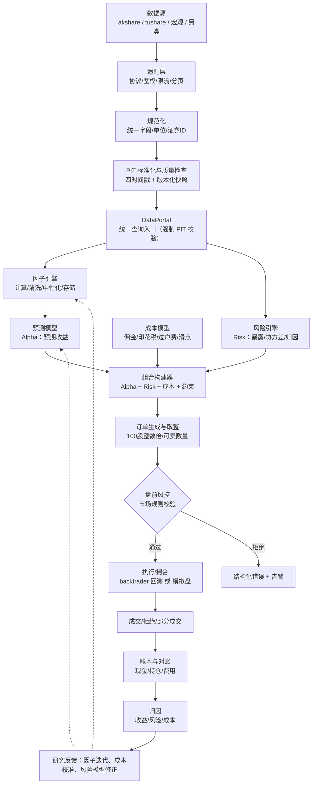
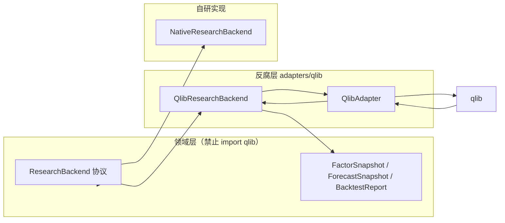
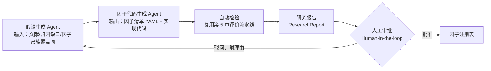
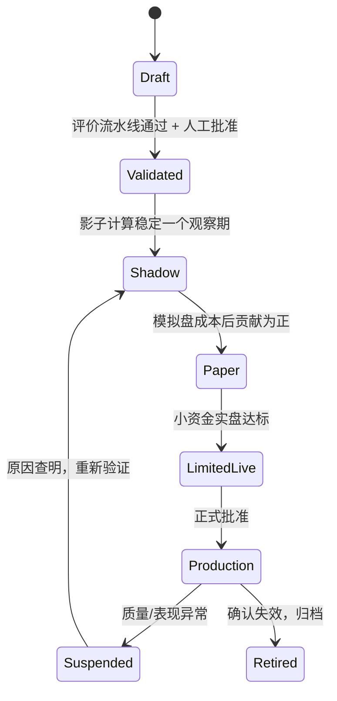
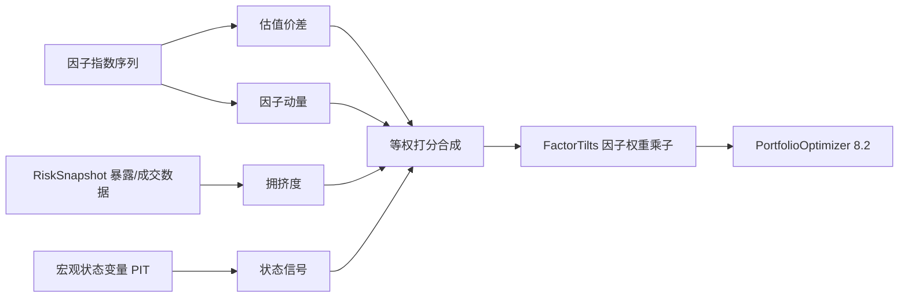
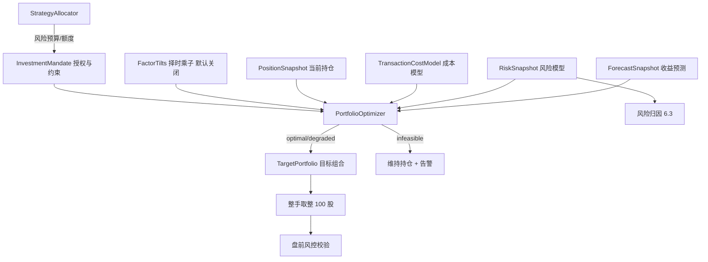

# 多因子量化研究、回测与交易系统设计文档

> 版本：v1.0　日期：2026-08-30
> 范围：A 股多因子选股（only-long），覆盖数据、因子、风险、组合、回测、交易全链路

## 1. 系统定位、目标与范围

本章回答三个问题：这套系统是什么、做到什么程度算成功、明确不做什么。定位与范围一旦确定，后续章节（数据平台、因子体系、风险、回测、交易）的所有设计决策都必须能回溯到本章给出的目标与约束。

### 1.1 系统定位

#### 1.1.1 全链路定位：数据→因子→模型→组合→回测→交易→归因的投研交易基础设施

本系统的定位不是"一个回测脚本"，也不是"一个因子库"，而是覆盖完整投研交易链路的基础设施：数据接入与治理、因子计算与检验、收益预测建模、组合构建、回测验证、交易执行、绩效归因，共七个环节，且归因结果回流到研究端形成反馈闭环。

这样定位的理由是：量化研究与交易失效的最常见根因，不是某个环节缺少先进算法，而是环节之间的口径断裂——研究用的数据口径与实盘不同、回测忽略的交易约束在实盘真实存在、归因无法拆解到因子层面导致无法定位收益来源。割裂的工具链会让每个局部最优在拼接后整体失真。因此系统把"链路一致性与可追溯性"置于"单点算法先进性"之上。

全链路并不意味着全链路自研。权衡如下：七个环节全部自研成本极高且重复造轮子；全部依赖单一框架（如 qlib）则会被其数据模型与回测假设锁死，无法处理 A 股的交易制度细节（见 1.4），也无法引入框架未覆盖的能力（Barra 风险归因、因子指数、因子择时、组合优化）。选择是：链路的领域语义与引擎内核由系统自己定义并持有，外围的具体实现通过适配器复用成熟开源组件——数据接入用 akshare/tushare，因子与模型研究复用 qlib，回测用 backtrader，详见第 2 章的适配器设计。

#### 1.1.2 双模式运行：研究模式（批量、可复现）与生产模式（增量、幂等、可恢复）共享领域语义

系统以两种模式运行同一套领域对象。研究模式面向批量计算与可复现性：任何一次实验都可以通过数据快照标识（snapshot_id）重建输入，相同输入必须得到相同结果。生产模式面向增量处理、幂等性与故障恢复：每日增量更新数据与因子，所有提交请求携带幂等键，进程重启或任务重跑不得产生重复计算或重复下单。

两种模式共享的是领域语义，而不是运行流程。共享语义包括：交易日历与市场规则、规范化数据字段定义、股票池定义、因子公式与版本、风险模型、交易成本模型、组合约束。运行流程则各自演化：研究侧强调大规模并行扫描与实验对比，生产侧强调定时调度、状态持久化与断点恢复。

这一划分针对的反模式是"研究一套代码、实盘另一套代码"：研究员在 Notebook 里用 pandas 快速拼出的因子逻辑，交给工程团队用另一套逻辑重写上线，两个实现之间的任何细微差异（复权方式、缺失值处理、对齐时点）都会 silently 侵蚀策略表现。本系统中，同一个因子定义对象既被研究引擎批量调用，也被生产调度增量调用，差异只存在于执行编排层。

### 1.2 设计目标与量化指标

目标必须可度量，否则架构评审无法收敛。以下指标同时是工程验收约束，而非性能宣传口径；首期硬件假设为单机（16 核 CPU、64GB 内存、NVMe SSD）。

#### 1.2.1 研究效率目标（新因子从想法到回测验证的时间约束）

| 指标 | 目标值 | 约束条件 |
|---|---|---|
| 新因子从想法到回测验证 | ≤ 30 分钟 | 日频因子、依赖数据已入库、复用标准检验流水线 |
| 全市场日频因子重算 | ≤ 10 分钟 | 约 5000 只股票、10 年历史、单机并行 |
| 十年期全市场事件驱动回测 | ≤ 30 分钟 | 含佣金税费、涨跌停、T+1、停牌处理 |
| 实验可复现性 | 100% | 相同 snapshot_id + 因子版本 + 代码版本必须产出相同结果 |
| 因子检验报告产出 | 自动生成 | IC/RankIC/ICIR、分组收益、换手、成本后收益、相关性一键出齐 |

"30 分钟"这一约束的推论是：数据查询、因子计算、检验报告必须全部流水线化，研究员不允许把时间消耗在数据对齐与清洗的重复劳动上——这正是数据平台（第 3 章）与因子体系（第 4 章）存在的理由。

#### 1.2.2 可替换性目标（数据源、回测引擎、模型框架均通过适配器接入，切换零业务代码改动）

| 可替换组件 | 首期实现 | 预留/备选 | 切换方式 |
|---|---|---|---|
| 行情与财务数据源 | akshare、tushare | 商业终端、宏观数据、另类数据 | 新增 Adapter + 修改配置，业务代码零改动 |
| 回测引擎 | backtrader（事件驱动，支持佣金税费自定义） | 自研引擎、其他开源引擎 | 实现统一 BacktestEngine 接口即可替换 |
| 模型/研究框架 | qlib（复用其表达式、模型与实验管理能力） | 自研研究后端 | 通过 QlibAdapter 隔离，领域代码不 import qlib |
| 执行场所 | 模拟撮合（模拟盘） | 券商实盘接口 | 实现统一 ExecutionVenue 接口 |

对 qlib 的策略是"复用但不依赖"：qlib 在因子表达式、数据处理器、模型训练与实验记录上开箱即用，应充分复用以缩短建设周期；但 qlib 未覆盖的能力——Barra 风格风险归因、因子指数构建、因子择时、带完整约束的组合优化——按"优先选用 star 数 10k 以上的成熟开源项目、无合适项目则自研"的原则补齐。任何情况下，领域层不直接依赖 qlib 的内部对象，qlib 的升版或移除不得引发业务代码修改。

### 1.3 范围界定

#### 1.3.1 首期范围：A 股日频/分钟频多因子选股，only-long，事件驱动回测 + backtrader，模拟盘

首期交付能力明确限定为：

- 标的与市场：A 股全市场股票，股票池支持上市天数、ST 状态、流动性等规则化过滤；
- 频率：日频为主，分钟频用于执行层模拟与更精细的成本估计；
- 策略形态：多因子选股、only-long（只能做多），组合权重满足 w_i ≥ 0、不加杠杆；
- 回测：事件驱动回测，引擎采用 backtrader，佣金、印花税、过户费、滑点可配置，完整模拟 T+1、涨跌停、停牌与 100 股整数倍约束；
- 交易侧：到模拟盘为止（模拟撮合 + 账本 + 对账），为实盘券商接口预留适配器接缝但首期不接入实盘。

#### 1.3.2 明确非目标：高频/微秒级交易、期货期权全品种、分布式计算框架自研

以下能力明确排除在首期范围之外，并说明理由：

- 高频与微秒级交易：需要 C++/FPGA、托管机房与做市级别的订单簿数据，与 Python 生态的研究型技术栈完全不兼容，投入产出比不成立；
- 期货、期权等全品种覆盖：衍生品涉及保证金、逐日盯市、行权交割等完全不同的领域模型，会污染首期围绕股票 only-long 建立的领域语义；领域模型预留多资产扩展点，但不做实现；
- 分布式计算框架自研：单机并行（多进程/向量化）足以覆盖首期 5000 只股票 × 10 年日频的计算量，引入分布式调度只在实测吞吐成为瓶颈之后再评估；
- 新因子自动上线：研究到生产必须经过显式的审批与生命周期状态流转（Draft→Validated→Paper→Production），不做任何"挖到因子自动部署"的捷径；
- 用复杂模型掩盖数据问题：当收益预测不佳时，优先排查数据质量、PIT 正确性与成本模型，而非叠加更深的网络。

### 1.4 A 股市场约束（贯穿全系统的领域前提）

A 股的交易制度不是回测里的"可选参数"，而是贯穿数据、因子、组合、执行、账本所有模块的领域前提。任何模块的设计如果与下表规则冲突，以本表为准。

#### 1.4.1 交易制度约束表：T+1、涨跌停（主板10%/创业板科创板20%/北交所30%）、100股整数倍、印花税/佣金/过户费、禁止做空（融券除外）

| 约束 | 规则 | 对系统的具体影响 |
|---|---|---|
| T+1 | 当日买入的股票次一交易日方可卖出 | 账本必须区分"持仓数量"与"可卖数量"；回测与盘前风控共用同一可卖口径 |
| 涨跌停 | 主板 ±10%；创业板、科创板 ±20%；北交所 ±30%；ST 股主板 ±5% | 涨停无法买入、跌停无法卖出，回测撮合必须按板块差异化建模，否则回测收益系统性虚高 |
| 最小交易单位 | 买入须为 100 股整数倍（科创板单笔≥200 股后可按 1 股递增）；卖出不足 100 股的零股须一次性卖出 | 组合优化输出的目标权重需经订单取整层处理，取整误差反馈给组合构建 |
| 印花税 | 卖出时按成交金额的 0.05% 征收（卖出单边，买入免征） | 成本模型买卖方向不对称，高换手策略的税后收益必须单独核算 |
| 佣金 | 券商佣金约万分之 2.5（买卖双向），单笔最低 5 元 | 小额订单的最低佣金会显著抬高单位成本，影响最小持仓与调仓频率设计 |
| 过户费 | 成交金额的 0.001%（买卖双向，沪深均收） | 量级小但须计入，保证账本与券商对账一致 |
| 禁止做空 | 普通账户不得卖空；融券卖出仅限两融标的且受券源与成本约束 | 组合约束强制 w_i ≥ 0；"多空对冲"类因子评价仅作研究参考，不进入可交易组合 |

表中费率为当前市场通行量级，仅用于系统默认参数；实际执行以交易所与券商的最新公告为准，费率必须作为可配置项而非硬编码。上述约束全部收敛到统一的"市场规则模块"（Market Rules），回测引擎、盘前风控与模拟撮合引用同一份规则定义，保证研究、回测与交易三处口径一致——这一要求在 2.1 的设计原则中进一步形式化。


## 2. 总体架构与设计原则

本章给出系统的顶层结构：四条核心设计原则（决策时的取舍依据）、六层分层架构（代码组织与调用边界）、以及统一的领域概念分类（全系统通用的词汇表）。后续每一章的详细设计都是本章原则在特定领域的展开。

### 2.1 核心设计原则

#### 2.1.1 领域接口优先：Qlib/akshare/tushare/backtrader 均为可替换 Adapter，领域代码不 import 第三方框架

系统内部的所有协作只通过领域接口（Domain Interface）进行，第三方框架的对象永远不出现在领域层的函数签名与数据结构中：

```text
                 领域接口（系统自定义）
                          │
        ┌──────────┬──────┴──────┬──────────┐
        ▼          ▼             ▼          ▼
   AkshareAdapter TushareAdapter QlibAdapter BacktraderAdapter
   （行情/财务）    （行情/财务）    （研究/模型）  （事件驱动回测）
```

四个关键适配器的职责边界：

| 适配器 | 包装的开源组件 | 承担的职责 | 不承担 |
|---|---|---|---|
| AkshareAdapter / TushareAdapter | akshare、tushare | 供应商协议、鉴权、限流、分页、原始字段读取 | 字段标准化与质量检查（统一在数据平台做，不复制到每个适配器） |
| QlibAdapter | qlib | 内部数据快照与 Qlib 数据集互转、训练任务映射、实验记录与预测结果映射 | 不作为内部数据模式、PIT 治理、生产账本的事实来源 |
| BacktraderAdapter | backtrader | 将策略决策映射为 backtrader 订单、注入 A 股佣金税费与涨跌停规则、回测结果映射为统一 BacktestReport | 不直接定义交易成本与撮合规则（来自市场规则模块） |

权衡与选择：接口抽象有真实成本——每多一层间接，就多一份映射代码与调试成本。因此原则附一条限制：只在"已存在两个以上实现"或"有明确替换需求"的接缝处建立抽象（数据源、回测引擎、研究框架、执行场所均满足该条件），不为一臆想中的替换预先设计接口。强制规则只有一条：领域代码中禁止出现 `import qlib`、`import backtrader`、`import akshare` 等第三方框架语句，这些 import 只能存在于对应适配器包内，由代码检查（lint 规则）在 CI 中强制拦截。

#### 2.1.2 可信时间优先（PIT）：event_time/publish_time/available_time/ingested_at 四时间戳

Point-in-Time（PIT，时点可信）原则要求：任何一条可用于研究或交易决策的数据，必须能回答"在决策时刻，系统当时实际能看到什么"。仅按报表期或交易日对齐不构成 PIT 数据——例如上市公司年报的报告期是 12 月 31 日，但实际披露可能迟至次年 4 月，若按报告期取用就会产生前视偏差（Look-ahead Bias）。

系统为每条数据维护四个时间戳：

| 时间戳 | 定义 | 示例（某年报数据） |
|---|---|---|
| event_time | 经济事件实际发生/截止的时间 | 报告期截止日 2024-12-31 |
| publish_time | 数据首次对市场公开的时间 | 年报公告日 2025-03-15 |
| available_time | 本系统在当时可实际使用该数据的时间 | 公告数据入库并质检通过 2025-03-16 |
| ingested_at | 当前数据版本进入系统的时间（修订时更新） | 更正公告后重新入库 2025-04-02 |

强制性规则：任何特征、因子与预测只能读取满足 `available_time <= decision_time` 的数据。回测引擎在每次数据访问时校验该不等式，违反时立即终止并报告字段、标的、数据版本与调用路径，不允许降级为"尽量对齐"。`ingested_at` 与 `available_time` 分离的意义在于支持数据修订的重放：同一 decision_time，用修订前与修订后的数据版本各跑一次，差异必须可归因到具体修订记录。

#### 2.1.3 Alpha / Risk / Execution 三权分离

系统将投资决策拆分为三个职责正交、独立演进的引擎：

- **Alpha**：预测未来收益。输入因子与特征，输出预期收益（或排序）。代表模块：因子引擎、预测模型。
- **Risk**：估计风险与控制暴露。输入持仓与市场数据，输出因子暴露、协方差、风险预测。代表模块：Barra 风格风险模型、风控引擎。
- **Execution**：以最低成本实现目标组合。输入目标组合与当前持仓的差异，输出订单计划并处理成交。代表模块：执行算法、OMS、成本模型。

三者的唯一汇点是组合构建器（Portfolio Constructor）：它同时消费 Alpha 的预期收益、Risk 的协方差与约束、Execution 的成本估计，求解出目标组合。禁止的反模式是把三者揉进一个 Strategy 类——那种结构下，改一个手续费参数需要动选股逻辑，换风险模型需要重写下单代码，任何局部修改都会全局扩散。三权分离还带来组织上的收益：Alpha 研究员、风险研究员、交易系统工程师可以各自迭代而不互相阻塞。

#### 2.1.4 显式失败与全链路版本化（数据快照、因子、模型、配置、代码）

**显式失败**：数据过期、字段缺失、风险模型不可用、优化求解失败、订单被拒绝等异常，必须产生结构化错误（机器可读的错误码 + 人工可读的原因）并触发告警，禁止三类静默行为：用前值/零值填充缺失数据、返回"形状正确但内容为空"的结果、优化失败时自动丢弃约束。一个"看起来在跑但输出不可信"的系统，比一个明确停机的系统危险得多。

**全链路版本化**：任何一次实验或交易决策，必须能沿以下链条完整追溯：

```text
Experiment / Decision
 ├── 数据快照 snapshot_id（含各数据源的 source_version）
 ├── 因子版本 factor_version（含参数哈希 parameter_hash）
 ├── 模型版本 model_version（含训练数据快照、超参数、随机种子）
 ├── 配置版本 config_version
 └── 代码版本 git_commit
```

版本化的验收标准是"相同键必须得到相同结果"：同一（snapshot_id, factor_version, parameter_hash, universe_version, decision_time）组合重复计算因子，结果不一致即判定为可复现性缺陷并阻断发布。版本对象一旦写入不可修改，修订只能通过产生新版本完成——这是 PIT 原则在元数据层面的对应物。

### 2.2 分层架构

系统在纵向上分为五层加一个横切的治理观测面。各层之间通过接口契约交互，禁止跨层调用，禁止下层反向依赖上层。

#### 2.2.1 六层架构图：适配层/基础设施层/领域引擎层/应用服务层/交互层 + 治理观测面

```text
┌───────────────────────────────────────────────────────────────────────────┐
│ L5 交互层（Presentation）                                                  │
│   研究工作台（IC/分组/相关性可视化） │ 回测报告平台 │ 交易终端 │ 监控告警    │
├───────────────────────────────────────────────────────────────────────────┤
│ L4 应用服务层（Application Services）                                      │
│   FactorResearchService │ BacktestService │ TradingService │             │
│   AttributionService（归因）                                               │
├───────────────────────────────────────────────────────────────────────────┤
│ L3 领域引擎层（Domain Engines）—— 纯领域逻辑，零第三方框架依赖               │
│   FactorEngine │ ModelEngine │ RiskEngine │ PortfolioEngine │             │
│   ExecutionEngine（Alpha / Risk / Execution 三权分离的载体）               │
├───────────────────────────────────────────────────────────────────────────┤
│ L2 基础设施层（Infrastructure）                                            │
│   数据存储与 PIT 查询（DataPortal） │ 因子存储 │ 实验追踪 │ 任务调度 │      │
│   消息与缓存 │ 配置/日志/异常体系                                          │
├───────────────────────────────────────────────────────────────────────────┤
│ L1 适配层（Adapters）                                                      │
│   AkshareAdapter │ TushareAdapter │ 宏观/另类数据 Adapter │ QlibAdapter │ │
│   BacktraderAdapter │ 模拟撮合/券商 Adapter                                │
├───────────────────────────────────────────────────────────────────────────┤
│ L0 外部世界：数据供应商 │ qlib │ backtrader │ 交易所/券商                  │
└───────────────────────────────────────────────────────────────────────────┘
        治理与观测面（横切各层）：数据与因子目录 │ 版本与审批 │ 监控告警 │
        收益/风险/成本归因 │ 审计
```

各层职责与调用约束：

| 层 | 职责 | 关键约束 |
|---|---|---|
| L1 适配层 | 屏蔽外部组件的协议与数据格式，向上暴露领域接口 | 唯一允许 import 第三方框架的层；不含业务规则 |
| L2 基础设施层 | 存储、查询、调度、缓存、实验追踪等通用能力 | 不含量化业务逻辑；PIT 校验在此层统一实施 |
| L3 领域引擎层 | 因子、模型、风险、组合、执行五大引擎 | 只依赖领域接口，不感知任何适配器与外部组件 |
| L4 应用服务层 | 面向用例的编排：研究流程、回测流程、交易流程、归因流程 | 做编排不做算法；研究模式与生产模式在此分化 |
| L5 交互层 | 可视化与人机交互 | 只读应用服务输出，不直连引擎 |
| 治理观测面 | 目录、版本、审批、监控、审计 | 横切各层，对 L1–L4 只有观测与准入控制，不参与数据流 |

调用规则：只允许上层调用紧邻下层的接口；L3 与 L4 之间、L2 与 L3 之间的接口是系统稳定的契约面；L1 实现"依赖倒置"——领域层定义接口，适配层实现接口，因此 qlib 升级、backtrader 替换、新增数据源的影响范围被严格限制在 L1 内部。


#### 2.2.2 数据流：数据源→规范化→PIT→因子→预测→组合→订单→成交→归因→研究反馈闭环



这条数据流中有三个设计要点。第一，PIT 校验收敛在 DataPortal 一处实施：因子代码、策略代码不得直接访问供应商 SDK、文件或数据库表，所有读取都经过统一入口，才能在单点强制 `available_time <= decision_time` 的检查。第二，Alpha 与 Risk 两条支线在进入组合构建器之前互不依赖（2.1.3 的三权分离），组合构建器是唯一的汇点。第三，归因不是链路的终点而是反馈的起点：成本归因校准成本模型，风险归因（Barra 风格）检验风险模型的解释力，因子归因指导因子的上下线——闭环使系统的各个模型随真实成交数据持续修正，而不是一次标定终身使用。

### 2.3 领域概念分类

系统内部最容易腐化的不是代码而是词汇：当所有东西都被叫作"因子"或"策略"时，接口边界随之消失。因此建立显式的概念分类，每个概念对应不同的接口、生命周期与治理方式。

#### 2.3.1 概念分类表：原始字段/特征/Alpha因子/风险因子/预测模型/策略/组合构建器/执行算法/投资授权

| 概念 | 定义 | 示例 | 治理要点 |
|---|---|---|---|
| 原始字段 | 外部数据经规范化后的基础字段 | 收盘价、成交额、公告日、总市值 | 带四时间戳与来源版本 |
| 特征 | 供统计或模型使用的派生变量 | 20 日波动率、盈利修正幅度 | 不一定有预测目标，可复用于多个因子/模型 |
| Alpha 因子 | 对未来收益具有预测目标的特征 | 价值、质量、动量 | 需经 IC 检验与生命周期状态流转（Draft→Production） |
| 风险因子 | 用于解释协方差与控制暴露的变量 | Size、Beta、行业 | 用于风险模型与约束，不直接用于选股打分 |
| 预测模型 | 将多个特征映射为预期收益或排序 | 线性模型、LightGBM | 训练/推理数据由外部显式传入，禁止自查"最新数据" |
| 策略 | 依据预测、状态与规则形成目标组合的决策单元 | 多因子选股、因子择时 | 不含底层因子计算与订单执行细节 |
| 组合构建器 | 在收益、风险、成本与约束下确定仓位 | Top-K、指数增强、均值-方差优化 | 三权分离的唯一汇点；优化失败须显式报告 |
| 执行算法 | 将目标仓位差异转化为可执行订单 | 限价、TWAP、VWAP | 只关心成本与可行性，不判断方向 |
| 投资授权 | 对账户可承担风险的正式约束集合 | 个股上限、行业偏离、杠杆上限 | 风控与组合优化共用同一份定义 |

分类的实践意义可以用三个容易混淆的例子说明：Smart Beta（如红利低波指数化产品）本质是规则化的组合构建器而非 Alpha 因子；Barra 的 Size、BP 等是风险因子，其用途是解释与约束而非预测收益；因子择时是策略层的决策逻辑而非一个新因子。三者若注册进同一种插件接口，研究审批、版本管理与风险归因的粒度将全部错位。

---

至此，系统"是什么、做到什么程度、按什么原则组织"已经确定。后续章节按数据流顺序展开：第 3 章数据平台落实 2.1.2 的 PIT 原则与适配层设计（akshare/tushare 接入、规范化模式、质量检查与多源路由）；第 4 章因子体系落实因子定义、流水线、检验与生命周期；其后的章节依次覆盖风险模型与 Barra 归因、组合优化、基于 backtrader 的事件驱动回测、交易执行与账本、归因与监控，形成与 2.2.2 数据流一一对应的完整设计。


---

## 3. 数据平台

数据平台是整个系统的事实来源（Source of Truth）。本章的设计目标有三：其一，接入面可扩展，行情、财报、另类、宏观四类数据经统一契约接入，新增供应商不改业务代码；其二，落地路径务实，首期优先打通交易数据（行情、复权、日历、证券主数据、交易状态），以 akshare 与 tushare 为主要来源；其三，治理前置，Point-in-Time（PIT，时点有效）时间语义、多源冲突策略与质量门禁在数据入库时就位，而不是在回测发现偏差后补救。第 2 章定义的四时间戳（`event_time`、`publish_time`、`available_time`、`ingested_at`）在本章落地为具体的数据集字段与查询约束。

### 3.1 数据源抽象与适配器

#### 3.1.1 统一接口契约：MarketDataSource / FundamentalDataSource / AlternativeDataSource / MacroDataSource

按数据的经济属性而非供应商划分接口，是数据源抽象的第一原则。同一供应商往往同时提供多类数据（例如 tushare 既提供日线行情也提供财务报表），若按供应商定义接口，领域代码会随供应商能力边界的变化而被迫修改；按数据品类定义接口，则每个接口的语义稳定，供应商只是接口的一个或多个实现。系统定义四类数据源契约：

```python
from dataclasses import dataclass
from datetime import datetime
from typing import Protocol


@dataclass(frozen=True)
class SourceRequest:
    resource: str            # 供应商侧资源名，如 "daily"、"income"
    symbols: tuple[str, ...] # 内部证券 ID 或宏观序列 ID
    start: datetime
    end: datetime
    cursor: str | None = None  # 分页游标，由上一批次的 SourceBatch 返回


@dataclass(frozen=True)
class SourceBatch:
    records: "DataFrame"       # 供应商原始字段，未做标准化
    source: str                # 数据源标识，如 "tushare_pro"
    source_version: str        # 接口/数据版本，用于血缘追踪
    next_cursor: str | None    # 为 None 表示拉取完毕


class MarketDataSource(Protocol):
    """行情与交易类数据：OHLCV、成交额、复权因子、涨跌停价、停牌状态。"""

    def fetch_bars(self, request: SourceRequest) -> SourceBatch: ...
    def fetch_adjust_factors(self, request: SourceRequest) -> SourceBatch: ...
    def fetch_trade_calendar(self, request: SourceRequest) -> SourceBatch: ...
    def fetch_instruments(self, request: SourceRequest) -> SourceBatch: ...
    def fetch_limit_status(self, request: SourceRequest) -> SourceBatch: ...


class FundamentalDataSource(Protocol):
    """基本面数据：三大报表、财务指标，必须携带公告时间与修订信息。"""

    def fetch_statements(self, request: SourceRequest) -> SourceBatch: ...
    def fetch_financial_indicators(self, request: SourceRequest) -> SourceBatch: ...


class AlternativeDataSource(Protocol):
    """另类数据：研报、新闻、公告原文等非结构化或半结构化内容。"""

    def fetch_documents(self, request: SourceRequest) -> SourceBatch: ...


class MacroDataSource(Protocol):
    """宏观与跨资产数据：利率、汇率、通胀、商品，按序列 ID 组织。"""

    def fetch_series(self, request: SourceRequest) -> SourceBatch: ...
```

接口设计有三点需要说明。第一，采用 `typing.Protocol`（结构化类型）而非抽象基类（ABC）：适配器无需继承任何系统基类，只要方法签名匹配即满足契约，这降低了第三方 SDK 包装的成本，也使契约测试（用同一套测试用例校验所有适配器实现）可以针对接口而非继承体系编写。第二，所有拉取方法统一返回 `SourceBatch` 并携带游标，将分页这一供应商差异最大的行为收敛为统一语义——有的供应商按页码分页，有的按日期截断，适配器内部消化差异后只暴露"是否还有下一批"。第三，接口返回的是**供应商原始字段**而非规范化字段，原因见下一节。

写入路径上，适配器的下游依次是原始落地区（Raw Layer，原样保留供应商返回以便重放与审计）、字段映射（SchemaMapper）、PIT 标准化、质量检查，最终进入规范化存储：

```text
外部数据源 → SourceAdapter → 原始落地区 → SchemaMapper
  → PIT 标准化（四时间戳标注） → 质量检查 → 规范化存储 → DataPortal
```

因子代码、策略代码只允许通过 DataPortal 按 `as_of` 查询规范化快照，不得直接访问供应商 SDK 或原始落地区。

#### 3.1.2 适配器职责边界：只做协议/鉴权/限流/分页，不做字段标准化

适配器的职责被刻意收窄为四件事：供应商通信协议（HTTP/RPC/SDK 调用）、鉴权（token、签名、密钥从密钥管理读取，不落盘到代码或配置仓库）、限流（按供应商配额做客户端节流与退避重试）、分页（游标推进）。**字段命名、单位换算、时区处理、缺失语义、冲突解决一律不在适配器内实现**，这些属于 SchemaMapper 与标准化层的职责。

这一边界的理由是演进成本。字段标准化规则会随研究需要持续调整（例如成交额单位从元改为千元、停牌编码扩展），若散落在各适配器中，一次调整要修改 N 个文件且各适配器容易漂移不一致；收敛到单一标准化层后，规则只有一份，且可以独立版本化、独立测试。同理，"主源失败后切换备源"也不属于适配器职责，而是 3.4.2 节路由层的显式策略——适配器只忠实报告成功或失败，不替系统做选择。

对应地，系统提供两类测试保障边界不被侵蚀：契约测试对所有 `MarketDataSource` 实现运行同一套用例（字段存在性、游标终止性、错误语义）；边界 lint 检查适配器包内不得引用标准化层模块，反向引用亦然。

### 3.2 交易数据优先的落地方案

#### 3.2.1 akshare 与 tushare 能力对比表（行情覆盖、财报、限流、免费/付费边界）

首期交易数据的两个候选来源是 akshare 与 tushare。两者都非机构级数据源，正确性需通过双源交叉校验（见 3.4.2）与质量门禁（见 3.5.1）兜底，这一前提决定了"同时接入、互为主备"而非"二选一"的策略。两者差异如下：

| 维度 | akshare | tushare（pro 接口） |
|---|---|---|
| 开源生态 | GitHub 约 22.3k stars，MIT License，社区高度活跃 | GitHub 约 15.4k stars；SDK 代码仓已基本停更，但 Tushare Pro 数据服务持续运营；SDK 为 BSD-3，数据服务本身为商业积分制 |
| 获取方式 | 免费、无需 token，直接调用 | 需注册 token；多数接口按积分制分级开放 |
| 数据通道 | 封装东财、新浪等公开网页接口，接口形态不承诺稳定 | 官方 REST API，接口契约相对稳定 |
| A 股日线行情 | 支持，含前/后复权选项 | 支持（`daily` + `adj_factor` 分离提供） |
| 分钟级行情 | 支持（东财通道） | 支持但受积分等级限制 |
| 财务数据 | 有财报类接口，字段随网页结构变化 | 三大报表、财务指标接口完整，含公告日字段 |
| 涨跌停/停牌 | 有涨跌停价格、停复牌类接口 | 有每日涨跌停价格（`stk_limit`）等接口 |
| 宏观数据 | 覆盖较广（利率、汇率、CPI 等，来自公开统计渠道） | 部分宏观序列，非其强项 |
| 限流特征 | 受上游网页接口约束，频率过高易被拒绝，需自行节流 | 服务端按积分配额限流，超限返回明确错误 |
| 许可与稳定性风险 | 上游页面改版会导致接口失效，需版本升级修复 | 付费/积分模式，配额与接口权限随等级变动 |

（开源项目 star 数与 License 为 2026-08-30 经 GitHub API 核实，详见第 11 章选型总表。）

基于上述对比，路由策略为：**akshare（免费广度）+ tushare pro（付费稳定性）双源互验**——日线行情、复权因子、涨跌停等高频核心字段双源采集、逐字段一致性校验，固定主优先级可配置；财报数据优先 tushare（公告日字段更规整，利于 PIT 治理），akshare 作为补充校验；宏观序列以 akshare 起步。该策略登记在数据字段目录中而非代码里，调整路由不改适配器。

#### 3.2.2 首期实现清单：日线行情、复权因子、交易日历、证券主数据、涨跌停与停牌状态

首期只实现日频交易数据闭环，范围刻意收窄，因为后续的因子计算、回测撮合、市场规则全部建立在这五张表的语义之上，任何一张表的时间语义含糊都会向上传染。

| 数据集 | 关键字段 | 落地要点 |
|---|---|---|
| 日线行情 `market_bar` | 内部证券 ID、交易日、开高低收、成交量、成交额、复权因子版本引用 | 原始价与复权因子分开存储，复权在查询时按口径计算，避免"复权后价格"被当作不可变事实入库 |
| 复权因子 `adjust_factor` | 证券 ID、生效日、累计复权因子 | 与 `corporate_action` 对齐校验；因子变更（公司行动补录）视为新版本而非原地覆盖 |
| 交易日历 `trading_calendar` | 交易日、交易所、交易时段、临时休市 | 日历是全局单例语义，回测、实盘、数据采集共用同一定义；临时休市以公告时间进入 PIT 链 |
| 证券主数据 `instrument_master` | 内部稳定 ID、供应商代码映射（带有效期）、上市/退市日期、交易所、证券类型、ST 状态区间 | 内部 ID 为主键，供应商代码（含更名、换码）只是带有效期的映射；退市股票保留，防止幸存者偏差 |
| 涨跌停与停牌状态 `limit_status` | 证券 ID、交易日、涨停价、跌停价、是否停牌、是否一字板 | 由行情与交易所公告双路推导并交叉校验；该表是回测撮合与盘前风控的共同输入 |

实现顺序上，先落交易日历与证券主数据（它们是其余三张表的主键与参照完整性基础），再落行情与复权因子，最后落涨跌停/停牌状态（依赖前四者做推导校验）。每个数据集发布为不可变快照，`snapshot_id` 连同 `source_versions` 写入元数据库，供实验记录引用。

### 3.3 可扩展的数据品类

#### 3.3.1 财报数据：公告时间链与修订链、PIT 查询

财报数据是 PIT 问题最集中的品类：报表期的经济事实（`event_time`，如 2024-12-31 年报）与市场首次得知该事实的时间（`publish_time`，公告日）之间通常相隔数月，且上市公司会发布修订版财报。若按报告期对齐使用财报数据，回测会系统性地提前使用尚未公开的信息，收益被显著高估。

因此 `fundamental_fact` 数据集按"事实 × 版本"建模：每条记录同时携带 `period_end`（报告期）、`publish_time`（首次公告时间）、`revision_seq`（修订序号）与 `available_time`（本系统可实际使用该版本的时间）。同一份年报的初版与修订版是两条不同记录而非原地更新。PIT 查询的语义为：给定决策时点 `as_of`，返回满足 `available_time <= as_of` 的每个 `(证券, 报告期, 科目)` 的最新版本。这一查询由 DataPortal 统一实现，因子代码不得自行编写"取最近一期财报"的逻辑——后者的写法在修订链存在时几乎必然引入未来数据。

需要承认的权衡是：akshare 与 tushare 的免费/低积分层级对公告日与修订历史的支持不完整，首期只能保证"公告日不晚于真实公告日"的保守口径（必要时以披露截止规则推断 `available_time` 上界），并在质量检查中对缺失公告日的记录降级处理。完整修订链依赖更高质量的数据源，属于数据预算升级时的优先采购项。

#### 3.3.2 另类数据：研报文本、新闻舆情——预留 NLP 特征抽取接缝

另类数据（研报全文、新闻、公告原文）按 `AlternativeDataSource` 契约接入，原始文档原样落入文档库，携带来源、抓取时间与指向正文的引用。系统首期**不做** NLP 特征抽取，只预留接缝：在文档库与因子体系之间定义 `NLPFeatureExtractor` 协议，输入为文档流，输出为带四时间戳的结构化特征（如情感得分、主题分布、事件标签），输出落库后与行情特征走完全相同的 PIT 与因子注册流程。

```python
class NLPFeatureExtractor(Protocol):
    def extract(self, documents: "DocumentBatch") -> "FeatureFrame":
        """将非结构化文档转为 (instrument_id, event_time, feature_name, value) 长表。"""
        ...
```

接缝设计的关键约束是：NLP 特征的 `available_time` 取抽取流水线实际完成时间而非文档发布时间，因为研究阶段用今天的模型重跑历史文本所产生的特征，在实盘当时并不存在。不区分这两者会在另类数据因子上制造隐蔽的未来数据。

#### 3.3.3 宏观与跨资产数据：利率、汇率、通胀、商品——统一 MacroDataSource 接口

宏观与跨资产数据（无风险利率、SHIBOR、人民币汇率、CPI/PPI、商品期货价格）的共同特征是：以序列（series）而非证券为组织维度，发布有固定时滞且经常修订（如 CPI 的季节调整）。统一 `MacroDataSource` 接口按 `series_id` 拉取，序列目录（series catalog）维护每个序列的经济含义、发布主体、发布频率、发布时滞与修订惯例。

宏观序列同样进入 PIT 体系：`event_time` 为统计期，`publish_time` 为发布时间，修订值形成版本链。宏观数据的消费方主要是风险模型（第 6 章）与因子择时（第 7 章），而非首期股票因子，因此首期仅需接入无风险利率（用于收益与夏普计算）与汇率占位，其余序列在消费方需求出现时按目录注册，不需要为此扩展接口。

### 3.4 规范化数据模型与多源路由

#### 3.4.1 逻辑数据集清单：instrument_master/market_bar/corporate_action/fundamental_fact 等

规范化层定义逻辑数据集，上层只认逻辑数据集与规范字段，不认供应商字段名。首期与扩展期的清单如下：

| 逻辑数据集 | 内容 | 首期/扩展 | 关键 PIT 字段 |
|---|---|---|---|
| `instrument_master` | 内部证券 ID、供应商代码映射、上市/退市、证券类型、状态区间 | 首期 | 状态有效期 |
| `trading_calendar` | 交易日、交易时段、临时休市 | 首期 | 公告时间 |
| `market_bar` | OHLCV、成交额、停牌标记 | 首期 | 交易日 |
| `adjust_factor` | 复权因子（版本化） | 首期 | 生效日 |
| `limit_status` | 涨跌停价、停牌、一字板 | 首期 | 交易日 |
| `corporate_action` | 分红、送股、拆并股、配股 | 首期（与复权因子联动） | 公告日、除权日 |
| `fundamental_fact` | 财务指标、报告期、修订链 | 扩展 | `period_end`/`publish_time`/`available_time` |
| `industry_membership` | 行业分类及有效期（申万/中信） | 扩展 | 生效区间 |
| `index_membership` | 指数成分及历史权重 | 扩展 | 生效区间 |
| `analyst_estimate` | 一致预期及修订 | 扩展 | 发布时间 |
| `reference_rate` | 无风险利率、汇率、基准利率 | 首期（无风险利率） | 发布时间 |
| `alternative_document` | 研报、新闻、公告原文 | 扩展 | 抓取时间 |

证券标识必须采用内部稳定 ID 作为主键。供应商代码会随更名、换码、借壳而变化，若作为主键，历史数据会在代码变更点断裂，且不同供应商代码体系无法对齐；内部 ID 配合带有效期的代码映射表，使代码变更成为一条普通的映射记录而非数据迁移事件。

#### 3.4.2 多源冲突策略：固定优先级/按时段/质量评分/一致性校验，禁止静默切换

同一规范字段可由多个数据源提供时，冲突解决规则登记在数据字段目录中，按字段配置，可选策略为：

| 策略 | 语义 | 适用场景 |
|---|---|---|
| 固定优先级 | 主源成功即采用，失败按优先级降级 | 有明确主备关系，如财报以 tushare 为主 |
| 按时段选择 | 不同历史区间使用不同来源 | 某源历史深度不足，拼接使用 |
| 质量评分 | 按完整性、延迟、历史差错率打分选优 | 两源质量接近且互补 |
| 一致性校验后选定 | 双源同时拉取，差异在容差内取主源，超容差阻断 | 行情收盘价等关键字段 |

**禁止静默切换**：任何一次降级或切换都必须写入 `source_versions` 并产生结构化事件，使每个数据快照可以回答"这条数据来自哪个源的哪个版本、是否发生了切换"。双源不一致超过容差时，默认动作是阻断该快照发布并告警，由人工裁决后显式登记，而不是由系统任选其一继续。这一规定的代价是偶发的发布延迟，换来的是数据错误的可归因性——在研究与实盘共用同一数据语义的体系中，可归因性的价值高于时效。

### 3.5 数据质量与存储

#### 3.5.1 质量检查清单与发布门禁（严重错误阻断快照发布）

每个数据集发布前必须通过质量检查，检查结果分级并版本化保存为 `DataQualityReport`：

| 检查项 | 规则示例 | 严重级别 |
|---|---|---|
| 模式校验 | 字段、类型、单位、时区符合规范 | 阻断 |
| 主键唯一性 | 无重复 `(instrument_id, trade_date)` | 阻断 |
| 交易日连续性 | 交易日历内无无故缺口 | 阻断 |
| 横截面覆盖率 | 当日有行情的股票数占应有比例不低于阈值 | 阻断 |
| 价格合理性 | 单日收益率超阈值、负价格、零成交但有价 | 复核 |
| 复权一致性 | 复权因子推导的收益率与披露收益率偏差在容差内 | 阻断 |
| 停牌一致性 | 停牌日无成交、复牌日价格跳变可解释 | 复核 |
| PIT 约束 | `available_time >= publish_time >= event_time` 序成立 | 阻断 |
| 主备源差异 | 双源关键字段差异在容差内 | 阻断（超容差时） |
| 修订链完整性 | 财报修订版本链无断档 | 复核 |

门禁规则为：阻断级（blocker）错误未清零，快照不得发布，流水线停在该版本上并告警，不允许"记录日志后继续"；复核级（warning）错误允许发布，但写入报告并进入调查队列。质量规则本身也版本化，规则收紧后历史快照不追溯重判，但新快照按新规则执行。

#### 3.5.2 存储选型：Parquet + DuckDB 起步，PostgreSQL 存元数据，后期 ClickHouse

存储按访问模式而非数据品类选择。权衡与选择如下：

| 存储 | 角色 | 选择理由 | 已知代价 |
|---|---|---|---|
| Parquet 文件（按数据集/日期分区） | 规范化时序与横截面数据、不可变快照 | 列存压缩比高；文件即快照，天然不可变、易归档；无服务进程，运维成本为零 | 不支持行级更新，修订数据只能追加新版本分区；并发写需外部协调 |
| DuckDB | 单机研究查询引擎 | 直接对 Parquet 做 SQL 与向量化分析，研究迭代无需数据搬入数据库 | 单机内存与核数上限；不适合在线服务 |
| PostgreSQL | 元数据、字段目录、因子注册表、实验记录、账本 | 事务与约束完备，元数据写入量小、一致性要求高 | 不承担大规模时序查询 |
| ClickHouse | 后期分钟级/逐笔数据与在线查询 | 列存时序吞吐高 | 引入运维成本，故推迟到日频数据量或查询并发证明有需要时 |

演进出口预留为 `DataStore` 接口（read/write/exists），Parquet 与 ClickHouse 分别是其实现，迁移只改配置不改调用方。首期的明确非目标是引入消息队列与分布式计算：在日频 A 股（约五千只证券）的规模下，单机 Parquet + DuckDB 的吞吐有数量级富余，提前引入分布式组件只会把工程预算消耗在运维上而非数据正确性上。

## 4. 因子体系与因子挖掘

本章定义因子从定义、计算、存储到复用 Qlib 能力的完整机制。设计围绕两条主线展开：一是可复现性，因子定义不可变、计算结果按复合键版本化，任意历史因子值可精确重建；二是复用边界清晰，与 qlib 重合的研究能力经反腐层（Anti-Corruption Layer, ACL）调用，领域代码不依赖 qlib，为后续替换或自研保留出口。

### 4.1 因子定义与注册表

#### 4.1.1 因子不可变清单（YAML）：公式/方向/频率/股票池/依赖/回溯期/中性化政策

每个因子以一份不可变清单（manifest）注册到因子注册表（Factor Registry）。清单一旦创建即冻结，任何修改（包括参数微调、中性化政策变化）都产生新版本而非原地编辑——这是实验间可比性的前提：只有定义不可变，两次实验的指标差异才能归因于数据或环境而非因子本身。

```yaml
factor:
  name: momentum_12_1            # 因子名
  version: 1.0.0                 # 语义化版本，任何变更递增
  category: alpha                # alpha / risk / technical / macro
  direction: positive            # 预期方向：值越大未来收益越高
  frequency: 1d                  # 计算频率
  universe: cn_equity_base       # 适用股票池（带版本）
  lookback: 13M                  # 回溯窗口
  publication_lag: 0D            # 数据发布滞后，参与 available_time 推算
  dependencies:                  # 数据依赖，指向逻辑数据集的规范字段
    - market_bar.close
    - trading_calendar
  neutralization:                # 中性化政策：显式声明，允许为 none
    industry: none
    size: none
  transforms:                    # 处理链，见 4.2
    - {type: winsorize, method: mad, n: 5}
    - {type: standardize, method: zscore}
  implementation: factors.momentum:Momentum121
  owner: quant-research
  description: 过去 12 个月剔除最近 1 个月的累计收益
```

清单中 `neutralization` 与 `transforms` 以显式字段而非代码默认值存在，原因见 4.2.1。注册表同时记录经济含义、预期换手与容量、已知失效条件等元信息，并对清单内容计算 `definition_hash`，用于判断两个实验引用的因子定义是否真正一致——同名单因子若哈希不同，其研究结论不可直接比较。

注册流程本身也是治理动作：新因子提交时，注册表校验清单模式（必填字段、依赖指向的规范字段存在、股票池已注册）、检查与既有因子的命名冲突，并将实现代码与清单绑定入库。清单中 `dependencies` 声明的数据依赖有两个用途：一是因子引擎据此做依赖解析与计算拓扑排序，因子所需数据缺失时在计算前显式失败而非产出残缺结果；二是数据平台据此做影响分析——某个数据集的 schema 变更或质量降级时，可以枚举受影响的全部因子并通知 owner。`publication_lag` 用于在因子值标注 `available_time`：即使输入数据全部满足 PIT 约束，一个假设"T 日收盘后可用"的因子若实际依赖 T 日晚间才发布的字段，也必须通过该参数显式声明，防止因子的可用时间被高估。

#### 4.1.2 因子存储键：name+version+parameter_hash+data_snapshot_id+universe_version

因子计算结果按复合键版本化存储：

```text
factor_key = name
           + version
           + parameter_hash        # 参数与 transform 配置的哈希
           + data_snapshot_id      # 输入数据快照（见第 3 章）
           + universe_version      # 股票池版本
           + decision_time         # 截面时点
```

该键表达了因子值的完整决定因素：同样的定义、同样的参数、同样的数据快照、同样的股票池，必须得到同样的因子值，否则视为可复现性错误并触发调查。存储层据此实现幂等：重复提交相同键的计算请求直接命中缓存，不产生重复计算，也不会因任务重试生成两份结果。因子血缘（lineage）由键自然承载——给定任一因子值，可回溯到公式版本、参数、数据快照与股票池版本，这正是第 2 章架构验收标准中"任意因子值可追踪"的落地机制。

### 4.2 因子计算流水线

#### 4.2.1 可插拔 Transform 链：缩尾/缺失/中性化/标准化/方向统一，中性化不默认写死

因子实现只描述公式（原始值的计算逻辑），从原始值到可入库因子值之间的处理由可插拔的 Transform 链完成：

```python
class Transform(Protocol):
    def transform(self, values: "DataFrame", context: FactorContext) -> "DataFrame":
        """输入/输出均为 (decision_time, instrument_id) 索引的因子值截面。"""
        ...
```

```text
原始计算 → 可交易过滤 → 缺失处理 → 缩尾（Winsorize） → 中性化（可跳过）
        → 横截面标准化 → 方向统一 → 覆盖率与质量检查 → 入库
```

链上各环节的设计要点如下。缩尾（winsorize）抑制极端值对横截面比较的主导，首期提供中位数绝对偏差（MAD）与分位数两种口径；缺失处理只允许"剔除"或"显式标记"，禁止静默填充零或均值——填充会把信息缺失伪装成信息；标准化提供 z-score 与 rank 两种，rank 对厚尾更稳健但丢失幅度信息，属因子级选择；方向统一将所有因子调整为"值越大预期收益越高"，使下游合成与归因不必逐一记忆方向约定。

中性化（neutralization，对行业、市值等风险暴露做回归取残差）**不在链上默认启用**，必须由清单显式声明。理由有二：其一，中性化是有经济含义的策略决策而非纯技术清洗——例如一个小市值因子若被默认做市值中性化，其主要收益来源就被移除了，研究结论将南辕北辙；其二，组合层面的暴露控制（第 8 章）与因子层面的中性化是两种替代方案，若因子已中性化而组合层再约束，会造成双重调整且难以归因。因此系统将中性化设计为显式、可配置、随定义哈希版本化的政策。

Transform 链的顺序本身影响结果（先缩尾后中性化与先中性化后缩尾不等价），因此链定义随因子清单版本化，链的执行由因子引擎统一完成，因子实现无权跳过或重排。

因子实现侧的接口刻意做薄：

```python
class FactorDefinition(Protocol):
    @property
    def key(self) -> FactorKey: ...

    def compute(self, context: FactorContext) -> "DataFrame":
        """只返回原始因子值；context.data 为受 PIT 约束的 DataPortal 视图。"""
        ...
```

`FactorContext` 向因子暴露的是决策时点、股票池快照与一个受限的 DataPortal 视图——该视图在查询时自动附加 `available_time <= decision_time` 约束，因子实现即使写出"取最新数据"的代码也读不到未来。依赖解析、计算缓存、按截面并行、时间校验与持久化全部由因子引擎在 `compute` 之外完成，因子代码因此保持纯函数形态：同样的输入快照与参数必然产生同样的输出，这也是 4.1.2 节存储键幂等性能够成立的工程基础。

### 4.3 与 Qlib 的复用边界（核心章节）

对 qlib 的总策略是：**复用其研究生产力的上限，隔离其设计假设的下限**。qlib 在表达式计算、预置因子库、模型训练与实验管理上可以显著缩短研究路径；但其数据模型不承载 PIT 治理、其工作流不包含准入审批、其回测不覆盖 A 股微观交易约束，这些缺口决定了系统的事实标准必须是自有领域模型，qlib 只是研究与回测的一种实现。

#### 4.3.1 复用清单：表达式引擎、Alpha158/Alpha360、DataHandler、模型、Workflow/Recorder——经 QlibAdapter 接入

| qlib 能力 | 复用方式 | 复用理由 |
|---|---|---|
| 表达式引擎 | 经 QlibAdapter 将 qlib 表达式语法映射为内部因子定义 | 表达式声明式、易批量生成，适合因子初筛与 Alpha158 批量导入 |
| Alpha158/Alpha360 | 批量导入为内部因子清单（每个表达式一个因子版本） | 快速建立量价因子基线，避免重实现数百个已知算子 |
| DataHandler / DatasetH | 适配为内部训练数据集的构建后端之一 | 数据切片、特征对齐逻辑成熟 |
| 模型实现（LGBModel 等） | 包装为内部 `ForecastModel` 实现 | 与研究社区结果可比，作为模型基线 |
| Workflow / Recorder | 作为实验记录的一种后端，产物映射回内部实验记录 | 减少实验追踪的自研工作量 |

所有复用均通过 QlibAdapter 完成：内部对象在适配器边界与 qlib 对象双向转换，qlib 的类型不渗入领域层。此处涉及的三个内部对象统一定义：`FactorSnapshot`（因子值快照，见 4.1.2）；`ForecastSnapshot`（预测快照——预测模型在某一决策时点输出的不可变预期收益序列，携带模型 ID、模型版本与 PIT 时点）；训练任务（特征列表、标签定义、数据快照与超参的完整描述）。

表达式引擎的映射是适配器中最有代表性的工作。qlib 表达式（如 `Mean($close, 20)`）经 QlibAdapter 解析后翻译为内部因子清单加表达式算子树：清单记录依赖字段（`market_bar.close`）、回溯窗口（20 个交易日）与参数，算子树由内部表达式执行器在规范化数据上求值。这样处理的取舍是：不复用 qlib 的表达式求值器本身，只复用其表达式**语法与算子语义**——求值逻辑留在内部执行器，才能保证 PIT 约束与存储键语义对所有因子一致生效；代价是需要维护算子对照表并在语义有歧义时（如复权口径、停牌日填充）以内部数据语义为准做显式裁决。

#### 4.3.2 不复用清单：PIT 治理、因子注册审批、生产账本、OMS、实盘风控

| 能力 | 不复用 qlib 的原因 | 系统内归属 |
|---|---|---|
| PIT 数据治理 | qlib 数据模型按"特征 × 时间"组织，不承载公告时间链、修订链与 `available_time` 语义 | 第 3 章数据平台 |
| 因子注册与审批 | qlib 无因子清单、定义哈希与生命周期管理 | 4.1 节、5.3 节 |
| 生产账本与对账 | qlib 无账本语义 | 第 10 章 |
| OMS 与订单状态机 | qlib 的 Executor 面向回测撮合，不处理券商订单状态、幂等与断线恢复 | 第 10 章 |
| 实盘风控 | qlib 无盘前/盘中风控机制 | 第 10 章 |
| A 股交易规则 | T+1、涨跌停、停牌等需在事件驱动回测与风控中共享同一定义 | 第 9、10 章 |

数据集成方向也因此确定为：内部规范化存储是事实来源，向 qlib 暴露只读快照（首期从 Parquet 快照构建 qlib 数据缓存，后期可编写自定义 Provider），**不把 qlib 的二进制数据目录当作数据仓库**。实验记录无论走哪条后端，都必须保留内部 `data_snapshot_id`，保证跨后端的实验可比。

#### 4.3.3 反腐层设计：ResearchBackend 协议（QlibResearchBackend / NativeResearchBackend），领域代码禁止 import qlib

反腐层以 `ResearchBackend` 协议为核心，将"训练一个模型""回测一个策略"这类研究动作抽象为领域语义，qlib 与自研实现分别是其一种后端：



```python
class ResearchBackend(Protocol):
    def train(self, task: "TrainingTask") -> "ModelArtifact": ...
    def backtest(self, task: "BacktestTask") -> "BacktestReport": ...


class QlibResearchBackend:   # 位于 adapters/qlib，唯一允许 import qlib 的包
    """将内部 TrainingTask/BacktestTask 映射为 qlib Task 配置，
    将 qlib Recorder 产物映射回内部实验记录与 BacktestReport。"""


class NativeResearchBackend:
    """自研后端：向量化初筛回测与模型训练的原生实现。"""
```

`QlibResearchBackend` 的具体职责包括：把内部数据快照映射为 qlib Provider 或 DataHandler 输入；把内部训练任务映射为 qlib 任务配置；把 qlib Recorder 产物映射为内部实验记录；把 qlib 预测与回测结果映射为统一的 `ForecastSnapshot` 与 `BacktestReport`。依赖方向由工程手段强制：包级 lint 规则规定 `qlib` 只允许出现在 `adapters/qlib` 内，领域代码出现 `import qlib` 即构建失败。

这一结构的收益是双重的。研究期，`QlibResearchBackend` 让研究员直接使用 Alpha158 与 qlib 模型栈；当 qlib 的回测假设与 A 股规则出现不可调和的差异时，`NativeResearchBackend`（以及第 9 章以 backtrader 为底座的事件驱动回测）承载正式验证，两套后端输出同一 `BacktestReport` 结构，差异可以逐项归因——"两套实现结论不一致"本身是重要的风险信号，若系统完全绑定单一框架，这一信号将永久丢失。

反腐层同时量化了退出成本。替换 qlib 需要重做的只有 `adapters/qlib` 包内的映射代码，领域对象、因子注册表、研究报告格式均不变；反向地，若自研后端在某项能力上被证明不成熟，也可以把对应任务路由回 qlib 后端而无需修改调用方。为防止后端能力漂移，契约测试对两个后端运行同一组任务并校验产出结构一致、关键指标在可解释容差内——例如同一因子组合在两套向量化回测下的 IC 必须一致（纯函数），而净值曲线允许因撮合假设不同产生有文档说明的偏离。

### 4.4 因子库建设路径

#### 4.4.1 首批因子：Alpha158 批量导入 + 经典量价/价值/质量/动量自研因子

因子库建设分两条线并行。第一条线是基线覆盖：通过 QlibAdapter 将 Alpha158 批量导入注册表，每个表达式注册为独立因子版本，一次性获得百余个量价因子的可用基线，用于校验数据平台与评价流水线（第 5 章）的正确性，也为后续模型提供特征池。第二条线是自研精品：按经典文献与经济直觉实现少量高质量因子，作为对基线的对照与改进方向：

| 家族 | 代表因子 | 构建要点 |
|---|---|---|
| 量价反转 | 5 日/20 日反转、换手率 | 纯行情可算，首期立即可用；注意与涨跌停状态联动剔除不可交易日 |
| 动量 | 12-1 动量、残差动量 | 剔除最近一个月以规避短期反转；残差动量需风险模型（第 6 章）配合，可后置 |
| 价值 | EP、BP、自由现金流收益率 | 依赖 `fundamental_fact`，财报 PIT 链路就绪后上线 |
| 质量 | ROE 及其稳定性、毛利率 | 同上，需修订链支持 |
| 波动与流动性 | 20 日波动率、Amihud 非流动性 | 纯行情可算，兼具 Alpha 与风险因子双重身份，注册时按用途归类 |

两条线的治理标准一致：Alpha158 导入因子同样要走评价流水线与注册审批，"来自知名因子库"不构成豁免理由——基线因子在 A 股样本上的表现需要在本系统数据语义下重新验证，且导入过程本身是对流水线吞吐能力的压力测试。

后续扩展按数据就绪度排期而非按想象力排期：财报 PIT 链路（3.3.1 节）就绪后上线价值与质量家族；行业分类与风险模型就绪后上线残差动量与中性化变体；分钟级数据落地后再考虑 Alpha360 形态的序列因子。每个家族扩充前先查 5.4 节的冗余分析，优先填补覆盖空白而非在同质方向上叠加变体——因子库的边际预算应花在增量信息上。

### 4.5 Agent Workflow 预留

#### 4.5.1 因子挖掘 Agent 化接缝：假设生成→因子代码生成→自动检验→报告，Human-in-the-loop 审批

因子挖掘的 Agent 化（由大语言模型驱动的假设生成与代码生成）在首期不实现，但流水线按"可被 Agent 调用"的形态设计，避免后期为自动化而重构。预留的接缝为：



支撑该流程的三个已有构件是：因子清单的 YAML 声明式格式（Agent 生成的代码必须配套生成清单，否则无法注册）、评价流水线的程序化接口（`ResearchEngine.evaluate` 接受因子键并返回结构化 `ResearchReport`，Agent 与人类研究员调用同一入口）、注册审批状态机（5.3 节）。审批节点不可绕过：Agent 生成的因子一律以 `Draft` 状态进入注册表，经人工审查经济含义与代码正确性后方可进入 `Validated`；自动检验通过不构成批准依据，因为统计显著性可以被搜索过程本身制造（5.2 节的多重检验问题在 Agent 批量生成场景下会被数量级放大）。任务编排上，生成与检验任务复用系统统一的任务队列与幂等键机制（任务类型 + 业务日期 + 配置版本 + 输入快照），Agent 工作流只是任务的生产者之一，不引入独立的调度体系。

实施时再补三条护栏，此处先登记为设计约束。其一，生成代码在沙箱中执行，只能访问受限 DataPortal 视图，禁止网络与文件系统任意写入；其二，假设生成设预算上限（每周检验次数），并把检验次数计入多重检验修正的分母，防止"算力换显著性"；其三，生成假设先与注册表做查重——与既有因子 `definition_hash` 或语义描述高度重合的假设直接驳回，避免 Agent 在已知因子的参数邻域内空转。

## 5. 因子研究与评价

本章定义因子从"算出来"到"被信任"之间的评价机制：统一的评价流水线保证每个因子接受同一套检验，统计纪律约束研究过程本身不产生虚假发现，生命周期状态机管理因子上线后的存续，冗余管理控制因子库的膨胀。评价的输出是结构化研究报告（`ResearchReport`），它是 5.3 节状态机中每次状态跃迁的输入凭证。

### 5.1 研究流水线与评价指标

#### 5.1.1 评价流水线：分布→IC/RankIC→ICIR/t-stat→分组单调性→衰减→中性化检验→成本后收益→容量

评价流水线按"从统计性质到经济价值"的顺序组织，每一步都可能否决因子，越早的步骤成本越低：

```text
分布与覆盖 → IC / RankIC → ICIR / t-stat → 分组单调性 → IC 衰减
  → 中性化检验 → 成本后收益 → 容量 → ResearchReport
```

各环节的目的依次为：**分布与覆盖**检查因子值的横截面分布（偏度、厚尾、异常值占比）与覆盖率，分布病态（如 90% 取值为零）的因子其 IC 计算没有意义，在此直接否决；**IC/RankIC**（Information Coefficient，信息系数）度量因子值与未来收益的横截面相关性，是预测能力的一阶证据；**ICIR 与 t 统计量**把 IC 的时间序列波动性纳入考量，区分"稳定的小预测力"与"偶发的大预测力"；**分组单调性**按因子值分组构建组合，要求收益随分组单调排列——IC 显著但分组非单调的因子，其预测力往往集中在极端组，可投资性差；**IC 衰减**考察不同持有期下 IC 的衰退速度，决定因子的调仓频率与预期换手；**中性化检验**分别报告原始因子与行业/市值中性化后的表现，识别因子的收益中有多少来自已知风险暴露的伪装；**成本后收益**将换手率与第 9 章成本模型结合，检验毛收益能否覆盖真实交易成本；**容量**估计因子策略可承载的资金规模上限。

流水线全程在同一数据快照、同一股票池版本上运行，报告记录全部输入版本，保证不同因子的评价结果横向可比。

流水线的产出 `ResearchReport` 是不可变研究档案，固定包含以下章节：因子定义与清单哈希、数据覆盖与分布、IC 分析、分组分析、衰减、暴露、成本与容量、稳健性（子样本与参数敏感性）、与既有因子的相关性与增量贡献、样本内/验证集/样本外三段结果、结论与建议。报告生成后连同输入版本写入实验记录，后续任何状态跃迁（5.3 节）引用报告 ID 而非口头结论；报告不随因子的后续表现改写，因子表现恶化时在监控与归因模块中记录，历史报告保持原样以维持审计意义。

#### 5.1.2 指标表：IC 均值/ICIR/分组收益/多空/换手/成本/容量/暴露/衰减

| 指标 | 计算口径 | 解读要点 |
|---|---|---|
| IC 均值 | 各截面因子值与未来 T 期收益的 Pearson 相关系数，取时间序列均值 | 受极端值影响，厚尾分布下参考 RankIC |
| RankIC | 同一截面的 Spearman 秩相关系数 | 对单调变换不变，更稳健 |
| ICIR | IC 时间序列均值 / 标准差 | 年化口径需注明；不稳定因子 ICIR 低 |
| IC t-stat | ICIR × √T（T 为截面数） | 显著性的粗略判据，需配合 5.2 节多重检验修正 |
| 分组收益 | 按因子值分 5/10 组的等权组合年化收益 | 检查组间单调性与多空两端的对称性 |
| 多空收益 | 顶组减底组（或按市值加权）的对冲收益序列 | A 股做空受限，多空收益仅为诊断口径，不等于可投资收益 |
| 换手率 | 调仓期组合权重变化的单边比例 | 与 IC 衰减共同决定调仓频率 |
| 成本后收益 | 毛收益 − 成本模型估算的交易成本 | 高换手低 IC 因子在此环节被否决 |
| 容量 | 按参与率上限与平均成交额反推的可承载资金规模 | 小盘流动性因子容量天然受限 |
| 暴露 | 因子值对行业、市值等风险因子的截面回归暴露 | 识别伪装的风格暴露 |
| 衰减 | IC 随持有期 1/5/10/20 日的序列 | 估计半衰期，决定信号使用时效 |

表中指标均要求同时报告样本内/验证集/样本外三段数值，单看全样本均值会掩盖时段不稳定性；IC 与分组收益还应按年度与市场阶段切分，暴露因子的 regime 依赖性。

### 5.2 统计纪律

#### 5.2.1 Walk-forward、Purged CV + embargo、多重检验修正、最终测试集只用一次

因子研究的中心风险是研究过程本身制造虚假显著性。系统以四条纪律约束：

**Walk-forward 验证**：参数与模型选择只在滚动训练窗内进行，验证窗严格在其后，避免任何"用未来选参数"的路径。**Purged K-Fold + embargo**：金融标签有持有期重叠（如 20 日前向收益），相邻样本的标签区间交叠会造成训练/验证信息泄漏；Purged 交叉验证（见 López de Prado《Advances in Financial Machine Learning》）剔除与验证集标签区间重叠的训练样本（purge），并在边界处再留 embargo 间隔，使交叉验证结论不依赖重叠信息。**多重检验修正**：批量挖掘（尤其 4.5 节 Agent 场景）会检验成百上千个因子，族错误率（Family-Wise Error Rate）失控；系统按检验次数自动应用 Bonferroni 或 Benjamini-Hochberg（FDR）修正，并在报告中同时给出修正前后 p 值，隐瞒检验次数的报告视为无效。**最终测试集只用一次**：样本划分为研究集、验证集与最终测试集，最终测试集在候选因子冻结后使用且只使用一次，任何在最终测试集上的反复查看再调参都会把测试集变成训练集的一部分。

这些纪律由流水线强制执行而非依赖研究者自觉：数据切分方案随实验记录版本化，最终测试集的访问由权限控制并留审计日志。

执行层面的两个细化约定。其一，Walk-forward 的参数在每个滚动窗内选定后即冻结写入实验记录，窗间参数漂移本身是风险信号——若最优参数逐窗剧烈变化，说明因子对参数高度敏感，稳健性章节必须对此给出解释而非取各窗平均指标。其二，多重检验修正的计数范围是"在同一研究集上进行过的全部检验"，包括被否决未上报的因子；评价流水线自动累计每个研究集上的检验次数并写入修正计算，研究者无法通过"失败的实验不记录"来缩小分母。对以夏普比率类指标做筛选的场景，可进一步参考 Deflated Sharpe Ratio 的思路，把试次数量、收益序列的非正态性纳入显著性折算。

### 5.3 因子生命周期管理

#### 5.3.1 状态机：Draft→Validated→Shadow→Paper→LimitedLive→Production→(Suspended/Retired)，滞回机制



各状态的语义为：`Draft` 已注册未完成评价；`Validated` 评价通过但未在实时数据上运行；`Shadow` 每日随生产数据影子计算，检验工程正确性（覆盖率、计算耗时、与回测口径的一致性）而非预测力；`Paper` 进入模拟组合；`LimitedLive` 小资金真实交易，校准成本模型假设；`Production` 正式服役。每次跃迁都需结构化凭证（研究报告、影子运行记录、模拟盘归因）与人工审批记录，不允许跳级。

| 跃迁 | 准入凭证 | 核心考察 |
|---|---|---|
| Draft → Validated | 完整 `ResearchReport` | 统计显著性、成本后收益、增量贡献（5.4 节） |
| Validated → Shadow | 影子计算部署单 | 实时数据下的工程正确性与 PIT 合规 |
| Shadow → Paper | 一个完整观察期的影子运行记录 | 实盘数据口径与回测口径的一致性 |
| Paper → LimitedLive | 模拟盘归因报告 | 成本假设与现实撮合的偏差 |
| LimitedLive → Production | 小资金实盘归因与风控记录 | 真实成本、容量、运营稳定性 |
| Production → Suspended | 监控触发的结构化事件 | 滚动 IC 偏离、覆盖率异常、数据质量降级 |

下线侧采用**滞回机制（hysteresis）**：`Production → Suspended` 的触发阈值（如滚动 IC 显著低于历史分布下沿）与 `Suspended → Shadow` 的恢复阈值不相同，恢复要求强于触发，避免因子在边界附近反复上下线。禁止仅因短期 IC 为负自动永久下线：因子失效的判断必须综合统计显著性、结构性原因（规则变化、拥挤度）、成本后贡献与最小观察期，自动监控只负责触发 `Suspended` 并生成调查任务，永久 `Retired` 永远是人工决策。

### 5.4 因子关系与冗余管理

#### 5.4.1 相关性矩阵/层次聚类/因子家族/PCA，增量贡献检验

因子库的价值不在于因子数量而在于增量信息的总量，冗余管理回答"新因子带来了什么旧因子没有的东西"。系统在四个口径上维护因子间相关性：因子原始值截面相关、秩相关、IC 时间序列相关、因子组合收益相关——低原始值相关但高 IC 相关的因子对，说明二者捕捉了同一预测信号的不同变换，冗余判定以后两者为准。

在此之上做三层组织：**层次聚类**按 IC 相关性距离聚类，同簇因子互为候选替代；**因子家族**是按经济含义手工维护的分类树（如 QUALITY 下辖 ROE、ROA、盈利稳定性），聚类结果与家族结构的偏离本身是研究线索；**PCA** 用于估计因子库有效维度，主成分数远少于因子数说明库内信息高度冗余。

新因子入库前必须通过**增量贡献检验**：在已有生产因子集合上做截面回归（或以已有因子 IC 加权组合为基准），新因子的残差 IC（对已有因子正交化后的 IC）需在多重检验修正后仍显著，且加入后组合样本外夏普有经济意义的提升。两个条件缺一不可：前者排除"同一信号的新包装"，后者排除"统计显著但经济上无关"。未通过检验的因子不直接丢弃，标记为冗余并记录其所属簇，在生产因子失效时作为替代候选重新评估。

冗余分析是持续运维动作而非一次性检查：相关性矩阵与聚类结果随每次快照发布增量更新，跨期漂移（两个原本低相关的因子相关性持续抬升）通常预示市场环境或拥挤度变化，写入监控看板；因子家族树则在每次新因子注册时评审，防止分类体系随库膨胀而失真。


---

## 6. 风险模型与风险归因

本章解决两个相互衔接的问题：一是如何用一个维度可控、估计稳定的多因子结构刻画 A 股市场的协方差结构（风险模型），二是如何把组合的收益与风险分解到因子、行业与个股层面，形成可指导迭代的归因结论（风险归因）。这两者是第 8 章组合优化器的前置依赖——没有可信的 $\Sigma$ 估计，任何均值-方差类优化都只是在精确地放大估计误差。

### 6.1 开源选型结论

#### 6.1.1 结论：无 10k+ star 的 Barra 类开源实现 → 自研；参考 MSCI Barra CNE5/CNE6 公开模型结构

对 Barra 风格的多因子风险模型（结构化风险模型，Structured Risk Model）进行了系统性选型调研，结论为：截至 2026-08-30（star 数经 GitHub API 核实），开源社区不存在 star 数过万的 Barra 类风险模型实现。主要候选与参考材料如下：

| 候选 | Stars | License | 状态 | 评估结论 |
|---|---|---|---|---|
| YTZzzzz/Barra_CNE5 | 百星级 | 未明确 | 2018 年后停更，依赖 Wind 数据接口 | 可参考其 CNE5 因子计算流程，不可直接复用 |
| MSCI Barra CNE5/CNE6 公开模型白皮书 | — | — | 公开文档 | 模型结构、因子定义、估计方法的主要设计依据 |
| 券商金工复现研报（CNE5/CNE6 复现系列） | — | — | 公开文档 | 本土化参数（行业划分、半衰期、Newey-West 滞后阶数）参考 |
| qlib（~48.1k，MIT） | — | — | 活跃 | 不含结构化风险模型，仅提供研究侧因子与 ML 管线，本章能力需在其反腐层之上自建 |

权衡与选择：自行实现的代价是约 2–3 周的建模与验证工作量，以及对 Barra 方法论细节的理解门槛；收益是模型结构、数据口径（PIT，Point-in-Time）、行业分类版本完全可控，且与第 3 章数据平台、第 4 章因子体系共享同一套 PIT 数据语义，避免"风险模型用一套数据、选股用另一套数据"的一致性问题。考虑到该模块是组合优化与归因的公共底座、且无可信替代品，结论为**自研**，技术栈为 numpy/pandas/statsmodels（横截面回归与协方差估计）+ cvxpy（组合层面的风险计算与优化求解），模型结构对齐 MSCI Barra CNE5/CNE6 公开白皮书。

### 6.2 Barra 风格多因子风险模型设计

#### 6.2.1 模型结构：r = X·f + u；国家因子 + 行业因子 + 风格因子（Size/Beta/Momentum/Residual Volatility/Growth/BP/Liquidity/Leverage/Earnings Yield）

结构化风险模型把每只股票的收益分解为"共同因子可解释部分 + 个股特异部分"：

$$r_n = \sum_{k=1}^{K} X_{nk} f_k + u_n$$

其中 $r_n$ 为股票 $n$ 在一个估计期（日/周/月）内的超额收益，$X_{nk}$ 为股票 $n$ 在因子 $k$ 上的暴露（exposure，暴露值在估计期初已知，属于解释变量而非待估参数），$f_k$ 为因子 $k$ 在该期的收益（factor return，待估），$u_n$ 为不能被共同因子解释的特异收益（specific return），假设 $E[u_n]=0$ 且 $Cov(u_n, u_m)=0\ (n\neq m)$。在此假设下，全市场的股票协方差矩阵为：

$$\Sigma = X F X^{\top} + \Delta$$

其中 $X\in\mathbb{R}^{N\times K}$ 为暴露矩阵，$F\in\mathbb{R}^{K\times K}$ 为因子收益协方差矩阵，$\Delta=\mathrm{diag}(\delta_1^2,\dots,\delta_N^2)$ 为特异方差对角阵。与直接用 $N$ 只股票历史收益估计样本协方差（需要估计 $N(N+1)/2$ 个参数，且当历史窗口 $T<N$ 时矩阵奇异、极端不稳定）相比，结构化模型把估计维度降到 $K(K+1)/2+N$（$K\approx 40$ 量级、$N$ 为数千），参数个数减少两个数量级，样本外稳定性显著提升；同时因子协方差 $F$ 可通过时间序列收缩进一步降噪。这是选择结构化模型而非样本协方差或 Ledoit-Wolf 收缩协方差的核心理由：只有结构化模型同时给出"可解释的暴露"与"稳定的协方差"，前者是约束与归因的语言，后者是优化的输入。

因子集按 CNE5/CNE6 的公开结构设计为三类：

| 因子类别 | 因子 | 定义与构建要点 | A 股本土化注意点 |
|---|---|---|---|
| 国家因子 | Country | 截距项，等价于全市场等权/市值加权组合收益 | 参与行业因子约束：行业因子收益以国家因子为基准解释（市值加权行业收益和为零） |
| 行业因子 | Industry（申万一级/中信一级，约 30 个） | 0/1 哑变量，按决策日生效的行业分类版本 | 必须使用 PIT 行业分类历史，记录指数成分调整与行业改判；申万 2021 版与中信 2020 版需各自建版本号 |
| 风格因子 | Size | $\ln(\text{总市值})$，再对非线性规模（Nonlinear Size，Size 立方项正交化）做剥离 | A 股小市值效应强且带壳价值噪音，需剥离 Size 中的非线性部分 |
| 风格因子 | Beta | 个股超额收益对市场收益的时间序列回归斜率，窗口 252 日、半衰期 63 日指数加权 | 剔除长期停牌段；次新股上市不满窗口时按行业 Beta 填充并打缺失标记 |
| 风格因子 | Momentum | 过去 504 日中剔除最近 21 日的累计超额收益（504/21 对应 CNE6；CNE5 为 252/21），半衰期 126 日加权 | 剔除最近一个月以避免 A 股显著的短期反转污染 |
| 风格因子 | Residual Volatility | 由 DASTD（日超额收益波动）、CMRA（累计收益离差）、HSIGMA（Beta 回归残差波动）三个描述子等权合成 | 三个描述子各自 winsorize + 标准化后再合成，避免单一描述子被异常行情主导 |
| 风格因子 | Growth | 预测/历史盈利增长率与营收增长率合成 | 一致预期数据缺失面大时退化为历史增长率，缺失处理需记录 |
| 风格因子 | BP | 最近财报期净资产/总市值（PIT 财报版本） | A 股壳价值导致部分高 BP 为"壳股"，建议与 Size 交叉检查极端暴露 |
| 风格因子 | Liquidity | STOM/STOQ/STOA（月/季/年换手率对数）合成 | 换手率高波动，需对换手率序列取对数并去极值 |
| 风格因子 | Leverage | MLEV（市场杠杆）/DTOA（资产负债率）/BLEV（账面杠杆）合成 | 金融地产天然高杠杆，中性化时保留行业内相对排序信息 |
| 风格因子 | Earnings Yield | EPIBS（分析师预测 EP）/ETOP（TTM 盈利收益率）/CETOP（现金盈利收益率）合成 | 负盈利股票的 EP 为负，不可简单丢弃，按原值参与标准化 |

所有风格因子暴露的处理流程统一为：原始描述子 → 去极值（MAD 或分位数 winsorize）→ 缺失值行业均值填充 → 标准化（z-score，以自由流通市值加权使全市场加权均值为 0、标准差为 1）。多个描述子合成一个风格因子时采用等权或 IC 加权，权重随模型版本固化。

#### 6.2.2 估计方法：WLS 横截面回归、因子收益 Newey-West 调整、特征值调整、特异风险贝叶斯收缩

模型估计分四步，每步的选择与理由如下。

第一步，因子收益估计采用加权最小二乘（WLS）横截面回归。每个交易日 $t$ 以全市场股票为样本回归 $r_t = X_t f_t + u_t$，权重取市值平方根 $\sqrt{MC}$。取平方根而非市值本身的理由：纯市值加权会让回归几乎只拟合大盘股、牺牲中小盘拟合优度；等权则让微盘股噪音主导估计；平方根是 CNE 系列采用的经验折中。行业因子与国家因子之间存在共线性（行业哑变量行之和等于国家因子列），处理方式是加约束"市值加权行业因子收益为零"，把共线性转化为可解释的基准化。

第二步，因子协方差矩阵 $F$ 由因子收益历史序列估计。直接对日度因子收益取样本协方差会受自相关与新息异方差污染，因此：协方差主体采用指数加权（半衰期约 90–125 日）以更快响应波动率状态切换；标准误与自相关校正采用 Newey-West 调整（滞后阶数取 5–10 个交易日），其目的是消除因子收益序列自相关导致的协方差低估——A 股动量、流动性类因子的日收益存在显著正自相关，不调整会系统性低估组合风险。此外叠加波动率状态调整（Volatility Regime Adjustment），用近期截面离差与长期均值的比值对 $F$ 做缩放，缓解指数加权在波动率跳变时的滞后。

第三步，特征值调整（Eigenfactor Risk Adjustment）。对 $F$ 的协方差结构做蒙特卡洛偏差校正：结构化模型对"样本内被解释、样本外失效"的因子方向会低估风险，按 CNE 方法论以模拟重抽样的方式估计每个特征因子上的系统性低估系数并放大相应特征值。直觉上，横截面回归在每个估计期都"最优地"拟合了当期因子收益，导致因子收益的样本内波动系统性小于样本外，特征值调整正是修正这一偏差。该调整在小样本（估计窗口短、股票池快速扩容）情形下收益最明显，A 股 2015 年后股票数量翻倍，此项不建议省略。

第四步，特异风险 $\Delta$ 估计与贝叶斯收缩。个股特异收益 $u_n$ 的方差用指数加权历史残差估计，但小样本下个股特异方差估计噪音大，按 CNE 方法做结构化贝叶斯收缩：先以 Size 分段（或 Size 回归）建立特异方差的先验 $\hat\delta^2_{prior}(Size)$，再按样本可信度将个股估计向先验收缩，$\hat\delta^2 = q\cdot\hat\delta^2_{raw} + (1-q)\cdot\hat\delta^2_{prior}$，$q\in[0,1]$ 按历史样本长度与残差稳定性确定。新股、次新股历史不足时直接采用先验值并标记。

风险模型对外输出统一的 `RiskSnapshot`，与第 4、5 章的快照体系一致，携带模型版本与 PIT 时点，供优化器与归因模块消费：

```python
@dataclass(frozen=True)
class RiskSnapshot:
    model_id: str                 # 模型标识，如 "barra_cne6_cn"
    version: str                  # 模型版本（因子定义/参数冻结）
    decision_time: datetime       # PIT 决策时点
    factor_exposure: DataFrame    # X：index=symbol, columns=[country, industry_*, style_*]
    factor_covariance: DataFrame  # F：K×K 因子收益协方差（Newey-West + 状态调整）
    specific_variance: Series     # Δ 对角元：index=symbol 的特异方差（收缩后）
    industry_map_version: str     # 行业分类版本（如 "sw2021"）
```

模型上线前需通过风险预测回测：滚动比较预测波动率与已实现波动率的偏差统计（bias statistic），理想值在 1 附近、$t$ 检验不显著；分位校准检验（预测 1% 分位的实际突破频率）用于检查尾部。偏差统计持续显著偏离 1 时按方向处理：系统性高估通常意味着协方差收缩过度或状态调整过激，系统性低估则优先排查特异风险的收缩强度与新股填充规则。验收阈值与重估频率（暴露日更、协方差周更或日更）写入模型治理配置；任何参数变更（半衰期、收缩强度、滞后阶数）都必须走模型版本升级流程并留档变更前后的偏差统计对比。

#### 6.2.3 A 股适配：行业分类（申万/中信）、风格因子本土化定义

行业分类是风险模型在 A 股落地最容易出错的部分，三条规则必须在数据平台层强制：其一，行业归属必须 PIT——上市公司行业改判、指数编制方（申万/中信）版本升级（如申万 2014 版到 2021 版）都必须以"生效日"方式入库，回测只能读取决策日生效的版本；其二，行业分类版本作为 `RiskSnapshot` 的显式字段随快照流转，组合优化的行业偏离约束与归因必须使用同一版本，禁止"优化用申万、归因用中信"的混用；其三，行业因子数量与颗粒度固定为一级行业（约 30 个），二级行业仅用于归因展示，避免因子维度膨胀。

风格因子定义的本土化差异集中在四点。第一，Size 必须剥离非线性规模项：A 股微盘股的壳价值与流动性溢价使收益-市值关系显著非单调，CNE6 的 Nonlinear Size 处理（Size 立方对 Size 正交化后作为独立因子）在 A 股比在美股更重要。第二，Momentum 剔除最近 21 日是硬约束：A 股月度反转强度显著高于成熟市场，不剔除近月收益的动量因子会被反转因子污染。第三，Liquidity 用换手率而非 Amihud 非流动性做为主描述子：A 股涨跌停制度下价格冲击弹性失真，换手率口径更稳健。第四，财务类因子（Growth、BP、Earnings Yield、Leverage）全部基于 PIT 财报版本（见第 3 章），报告期与实际公告日之间以公告日生效，防止使用尚未公开的数据；负盈利、负净资产样本不丢弃，按原值参与 winsorize 与标准化。

### 6.3 风险归因

#### 6.3.1 收益归因：因子贡献 + 特异贡献；风险归因：边际风险贡献/成分风险贡献

收益归因（return attribution）把组合在区间 $[t_1,t_2]$ 的主动收益（相对基准 $w_b$）逐期分解。单期内，主动收益为：

$$r_p - r_b = \sum_k (w_p - w_b)^{\top} X_{:,k}\, f_k + (w_p - w_b)^{\top} u$$

即每个因子的贡献 = 主动暴露 × 因子收益，残余项为特异贡献。多期累计用 Brinson 式链接或几何链接处理再投资效应。该分解直接回答"收益来自哪些风格的主动偏离、哪些来自选股（特异）"，与第 5 章因子评价的 IC 口径互相印证：若组合声称的超额来自选股，但归因显示主要来自 Size 暴露，则策略实质是风格赌注，治理上应触发复核。

风险归因（risk attribution）把组合总风险 $\sigma_p=\sqrt{w^{\top}\Sigma w}$ 分解到因子与个股。核心概念是边际风险贡献（Marginal Contribution to Risk, MCR）与成分风险贡献（Component Contribution to Risk, CCR）：

$$\mathrm{MCR}_k = \frac{\partial \sigma_p}{\partial x_k}, \qquad \mathrm{CCR}_k = x_k\cdot \mathrm{MCR}_k, \qquad \sum_k \mathrm{CCR}_k + \mathrm{CCR}_{specific} = \sigma_p$$

其中 $x_k = w^{\top}X_{:,k}$ 为组合在因子 $k$ 上的暴露。CCR 之和恒等于总风险（欧拉分配定理），因此可以做成"风险预算表"：每个行业、每个风格因子、特异风险各消耗了多少组合波动率。工程上把收益贡献与风险贡献分成两个独立接口——前者是事后记账（实算实现收益），后者既可事后（实现风险）也可事前（用 `RiskSnapshot` 对目标组合预测风险），两者不可混用同一个数据结构。事前风险归因是第 8 章优化器约束检查的依据；事后归因按日累计并在月度报告中给出因子贡献与风险贡献的交叉表，用于识别"消耗了大量风险预算却只贡献了微薄收益"的低效暴露。

#### 6.3.2 Brinson 归因作为行业配置视角补充

Brinson 归因（Brinson-Hood-Beebower 模型）把主动收益分解为配置效应（allocation effect）、选择效应（selection effect）与交互效应：

$$\text{配置} = \sum_i (w_{p,i} - w_{b,i})(r_{b,i} - r_b), \quad \text{选择} = \sum_i w_{b,i}(r_{p,i} - r_{b,i}), \quad \text{交互} = \sum_i (w_{p,i}-w_{b,i})(r_{p,i}-r_{b,i})$$

其中 $i$ 为分组（通常为行业）。它回答的是"行业配置对了没有、行业内选股对了没有"，语言上与投委会、客户报告的习惯一致，是多头的相对收益组合必备的标准视图。

但必须明确其边界：Brinson 只含一个分组维度，无法刻画风格因子交叉作用（如"小市值+低波"的联合暴露），也不含风险维度——它使用已实现收益分组平均，不区分"承担了风险获得补偿"与"单纯押注成功"。因此系统内定位明确：**Brinson 是行业配置视角的补充报告，因子归因是主要的诊断工具，两者并存、不可互相替代**。当两种归因结论冲突时（如 Brinson 显示选股贡献为正、因子归因显示特异贡献为负），通常意味着分组内的暴露差异主导了结果，此时以因子归因为准，因为因子归因的暴露-收益框架可以进一步定位到具体风格维度。工程实现上两者共用同一套 PIT 持仓与行业版本数据，归因结果按 `portfolio_id + 区间 + 归因方法 + 行业分类版本` 入库，保证可复算、可审计；对外报告默认同时给出两种视图并附口径说明，避免读者把 Brinson 的"选择效应"误读为纯选股能力。

## 7. 因子指数与因子择时

本章解决两个递进的问题：如何把单个因子的表现转化为一条可持续计算、可投资、可复核的"行情序列"（因子指数），以及是否、以及如何根据因子自身的状态调整其在组合中的权重（因子择时）。前者是后者的基础设施——没有对因子历史的干净度量，一切择时信号都建立在有偏的样本上。

### 7.1 开源选型结论

#### 7.1.1 结论：无成熟开源项目 → 自研

对因子指数（factor index，把因子本身指数化）与因子择时（factor timing）两个方向进行了选型调研：截至 2026-08-30，开源社区不存在维护活跃、可直接复用的成熟项目。商业侧有 MSCI Factor Indexes、中证/国证风格指数等产品化的因子指数，但其构建细则不透明、历史可复算性差，无法满足研究级可审计要求。可用的参考为学术文献：Gupta & Kelly《Factor Momentum Everywhere》（因子动量的普遍存在性，择时信号设计的核心依据）、Hodges et al.《Factor Timing with Cross-Sectional and Time-Series Predictors》（择时预测变量的横截面与时序框架）。

权衡与选择：自研的工作量主要在因子指数的可投资构建（纯因子组合求解依赖第 8 章优化器，可复用）与择时信号的统计纪律设计；收益是与第 6 章风险模型、第 4 章因子体系共享暴露定义与 PIT 数据，因子指数的口径天然与归因口径一致。结论为**自研**。

### 7.2 因子指数设计

#### 7.2.1 定义：因子纯多头组合/多空组合的净值序列，作为因子表现的"行情"

因子指数是一个规则透明、每日可再平衡的组合净值序列，其收益尽可能纯粹地暴露于目标因子。它承担三个角色：其一，研究口径——为因子评价（第 5 章）提供"去除市场beta与行业噪音后的因子纯收益"，IC 与分层收益都是组合层面的近似，因子指数是更严格的度量；其二，择时输入——第 7.3 节的估值价差、动量、拥挤度信号全部定义在因子指数序列之上；其三，产品参照——为风格暴露管理提供可交易的基准形态（纯多头版本）。

系统内区分两种形态：

| 形态 | 构造 | 用途 | 局限 |
|---|---|---|---|
| 多空纯因子组合 | 目标因子单位暴露、其余因子零暴露的多空组合 | 研究与择时信号（最干净的因子收益度量） | 含做空腿，A 股不可直接交易，仅作度量基准 |
| 纯多头因子组合 | 在 only-long 约束下最大化目标因子暴露、控制其余暴露偏离 | 可投资的风格配置工具、Smart Beta 类产品对标 | 暴露纯度受 only-long 约束限制，是"可投资性"与"纯度"的折中 |

两种形态共用同一套暴露定义与再平衡日历，净值序列按 `factor_id + 形态 + 版本` 入库，与 FactorSnapshot 的版本体系对齐。

#### 7.2.2 构建方法：纯因子组合（对其他因子中性化）+ 可投资性约束（流动性/换手缓冲）

纯因子组合（Pure Factor Portfolio）的定义：对目标因子保持单位暴露，对全部其他风格因子与行业因子暴露为零，且组合方差最小的组合。以第 6 章的暴露矩阵 $X$ 记（列含国家、行业、风格因子），对目标因子 $j$ 求解：

$$\min_w\ w^{\top}\Sigma w \quad \text{s.t.}\quad w^{\top}X_{:,j}=1,\ \ w^{\top}X_{:,k}=0\ (\forall k\neq j)$$

多空版本直接解此二次规划（QP），由第 8 章的 cvxpy 求解层完成。纯多头版本追加 $w_i\geq 0$ 与权重和约束，此时"其余因子严格零暴露"通常不可行，放宽为暴露偏离带（如 $|w^{\top}X_{:,k}|\leq 0.1$），并接受纯度损失——这是 only-long 市场下的固有折中，必须在指数文档中明示而非掩盖。

可投资性约束针对纯多头版本，三条规则：第一，流动性过滤，成分股需满足最低日均成交额（如近 20 日 ADV ≥ 5000 万元）与非停牌、非 ST 状态，防止指数给出无法成交的收益；第二，换手缓冲（buffer rule），成分调整采用"排名缓冲带"（如保持排名前 110% 的旧成分不调出），把单次再平衡换手压到约束内（如单边 ≤ 15%），控制指数自身的交易成本；第三，个股权重上限（如 5%）与自由流通市值加权下限，防止指数退化为单一小盘股。再平衡频率默认月度，与第 7.3 节的择时频率对齐；更高频率的指数只用于研究、不作可投资标的。

工程上，因子指数构建器复用组合优化器的约束表达与求解层（见第 8 章），区别仅在目标函数（最小方差/最大化暴露而非最大化 alpha）与约束集，避免维护两套优化代码。指数治理沿用因子体系的版本规则：构建参数（暴露带宽、流动性阈值、缓冲带宽度、再平衡日）随指数版本固化，参数变更产生新版本号并保留旧版本序列用于历史对照；每次再平衡输出成分与权重明细（含各因子暴露的事后核验值），核验"目标因子暴露是否在 $1\pm\epsilon$ 内、其余因子是否在带宽内"，不满足时该期指数标记异常并阻断下游择时信号更新。

### 7.3 因子择时设计

#### 7.3.1 择时信号：因子估值价差、因子动量、宏观状态变量、拥挤度

因子择时的前提是因子收益存在可预测成分。系统实现四类信号，均定义在第 7.2 节的因子指数序列与第 6 章的暴露数据之上：

| 信号 | 定义 | 逻辑 | A 股实证注意点 |
|---|---|---|---|
| 因子估值价差（Value Spread） | 因子多头侧与空头侧（或因子指数高暴露组与低暴露组）的估值差（BP/EP 价差），相对自身历史分位 | 价差走阔预示因子未来收益补偿上升 | 对价值类因子自身有内生性（估值既是信号又是因子定义），解释时需谨慎 |
| 因子动量（Factor Momentum） | 因子指数过去 6–12 个月（剔除最近 1 个月）累计收益 | Gupta & Kelly《Factor Momentum Everywhere》：因子收益存在显著时序动量，且部分解释个股动量 | 剔除最近 1 个月以避开 A 股短期反转；月频再平衡 |
| 宏观状态变量 | 利率（10Y 国债收益率及变动）、信用利差、CPI/PPI、货币供应、市场波动率状态 | 因子收益存在状态依赖（如高波动状态利好低波因子） | 宏观变量需 PIT 发布日生效；状态变量离散化（高/低）比连续回归更抗过拟合 |
| 拥挤度（Crowding） | 因子暴露的截面离散度、因子指数换手与成交占比、同类策略持仓重合度 | 拥挤的因子未来回撤风险上升（负向信号） | 拥挤度更像风险开关而非收益预测器，建议以"降杠杆"而非"反向"方式使用 |

四类信号的强度与稳健性依次递减（估值价差、因子动量有较强学术证据；宏观状态中等；拥挤度主要是风险控制），实现时按此顺序逐步启用，每个信号单独验收后再进入合成。多信号合成采用保守的等权打分（各信号标准化到 $[-1,1]$ 后等权求和再映射为 tilt），不采用回归加权——回归系数本身需要估计，在择时本就稀缺的样本量上会引入第二层过拟合。信号合成的完整数据流如下：



#### 7.3.2 输出形态：因子权重乘子（tilt），接入组合优化器而非直接改 Alpha

择时模块的输出不直接修改选股 alpha（ForecastSnapshot 中的预测值），而是输出一组因子权重乘子（tilt）：对每个择时范围内的风格因子 $k$ 给出 $m_k\in[m_{min}, m_{max}]$（如 $[0.5, 1.5]$，中性为 1.0），传入组合优化器后表现为两种等价形式之一：调整目标函数中的因子期望收益项（把 alpha 投影到因子空间后按 $m_k$ 缩放再还原），或调整该因子的暴露约束带宽（看好的因子放宽正向暴露上限）。选择"优化器层接入"而非"改 alpha"的理由有三：alpha 与择时的估计误差来源不同，混在一起无法归因；优化器层的 tilt 天然经过风险模型与约束的再平衡，避免择时信号破坏组合的风险预算；归因上 tilt 的贡献可以独立计量（因子暴露 × 因子收益），满足"成本后净贡献"的验收要求。

#### 7.3.3 择时纪律：低频调仓、多重检验修正、成本后净贡献为验收标准

必须明确：因子择时的预测置信度系统性低于选股——因子收益的样本量（时间序列长度）远小于截面选股（每期数千个截面观测），信号噪声比低，且择时收益高度集中于少数 regime 切换点。因此系统默认**关闭**因子择时，启用需满足以下纪律：

第一，低频调仓。择时信号月度更新、tilt 月度调整，单次 tilt 变动幅度设上限（如 $|Δm_k|\leq 0.25$）并叠加换手缓冲，防止信号噪音转化为交易成本。更高频的择时不予支持——因子收益的预测信噪比不支持日内/周内频率。

第二，多重检验修正。择时信号研究天然是多重假设检验场景（多信号 × 多参数 × 多区间），样本外验收必须应用检验修正（如 Bonferroni/Holm，或 Bailey 等人的 Deflated Sharpe Ratio 框架），研究期尝试过的信号变体数量必须记录在 MLflow 实验中并计入修正基数，禁止只报告"跑出来的那一组参数"。

第三，成本后净贡献为唯一验收标准。择时模块上线前的验收回测必须：使用完整交易成本模型（佣金、印花税、冲击成本）后的组合净值，对比"启用 tilt"与"tilt 恒为 1"两个版本；净贡献 = 超额收益差 − 增量成本，要求在全样本与滚动子区间（至少按年度切片）均为正且统计显著（修正后 $p<0.05$）；同时检查风险归因，确认择时贡献确实来自目标因子暴露变化而非残余的 Size/Beta 偏移。任一条件不满足则保持关闭。上线后按季度复核，复核内容包括信号衰减（信息系数滚动趋势）、tilt 实际换手率与成本占比、以及择时收益与选股收益的归因隔离是否仍然成立；连续两个季度净贡献为负触发自动降级（tilt 回到中性），重新启用需重新走完整验收流程，不允许"重启试试"。

## 8. 组合优化

组合优化是信号到持仓的最后转换层：输入第 5 章的 ForecastSnapshot（收益预测）、第 6 章的 RiskSnapshot（结构化风险）、成本模型与当前持仓，在投资授权约束下输出 TargetPortfolio。本章按"选型 → 问题定义 → 求解与降级 → 多策略配置"组织。

### 8.1 开源选型结论

#### 8.1.1 结论：cvxpy 为优化求解底座（复用）；PyPortfolioOpt/riskfolio-lib 参考实现

截至 2026-08-30 的调研结论如下（star 数经 GitHub API 核实）：

| 项目 | Stars | License | 角色 |
|---|---|---|---|
| cvxpy | ~6.3k | Apache-2.0 | **直接复用**：凸优化建模与求解底座，基础设施级组件，不以 star 数作准入门槛 |
| PyPortfolioOpt | ~6.0k | MIT | 参考实现：均值-方差、HRP 的口径可参考；A 股约束体系在 cvxpy 层自研 |
| riskfolio-lib | ~4.5k | BSD-3 | 参考实现：风险平价/风险预算（用于第 8.4 节多策略配置） |
| scipy.optimize | ~15.0k | BSD-3 | 兜底复用：cvxpy 不可解的非凸/小规模问题备用，不作主引擎 |

权衡与选择：组合优化没有单一 10k+ star 的专门项目，但优化的"难点"不在求解器而在问题建模（目标、约束、成本项的正确表达），这正是必须自研的部分。cvxpy 的价值在于把建模语言（DCP，Disciplined Convex Programming）与求解器（Clarabel/OSQP/ECOS/SCS，及商业 MOSEK/Gurobi 可插拔）解耦：用 cvxpy 表达问题后，开源求解器覆盖 QP/SOCP 已足够，未来需要 MILP（最小持仓取整）时可切换至支持整数规划的求解器而不改模型代码。DCP 规则同时在编译期拒绝非凸表达，等于为"问题必须是凸的"这一正确性前提提供了静态检查。PyPortfolioOpt 与 riskfolio-lib 不直接进生产路径，作为实现正确性的交叉验证基准（相同输入下权重与目标值应一致）。License 方面 Apache-2.0/MIT/BSD-3 均无传染性约束。

### 8.2 优化问题定义

#### 8.2.1 目标函数：max w'α − λ/2·w'Σw − γ·Cost(w−w_prev)

单策略组合构建的标准形式为：

$$\max_w\quad w^{\top}\alpha \;-\; \frac{\lambda}{2}\, w^{\top}\Sigma w \;-\; \gamma\, C(w - w_{prev})$$

其中 $\alpha$ 为收益预测向量（来自 ForecastSnapshot，截面标准化后的预期超额收益），$\Sigma = XFX^{\top}+\Delta$ 来自第 6 章 RiskSnapshot，$C(\cdot)$ 为交易成本模型（佣金 + 印花税 + 冲击成本的分段线性或二次近似，见第 9 章成本模型），$w_{prev}$ 为当前持仓权重。三项的工程语义：

| 项 | 角色 | 参数设定要点 |
|---|---|---|
| $w^{\top}\alpha$ | 收益项 | $\alpha$ 必须先截面标准化并做暴露正交化检查（剔除与风险因子定义重复的 naive 暴露），否则优化器会把风险暴露当 alpha 放大 |
| $\frac{\lambda}{2}w^{\top}\Sigma w$ | 风险惩罚项 | $\lambda$ 为风险厌恶系数，与目标跟踪误差换算：先按目标 TE 反解 $\lambda$ 的有效区间，再以区间中值作默认值；禁止研究员无标定地拍 $\lambda$ |
| $\gamma C(w-w_{prev})$ | 成本项 | $\gamma$ 控制成本权重，与换手约束联动：成本项是软约束、换手上限是硬约束，两者并存以防成本模型低估时换手失控 |

成本项的存在使问题不再是纯 QP（分段线性成本需引入辅助变量转为带线性约束的 QP），cvxpy 的 DCP 表达可以原生处理，这是选择它而非手写二次规划求解的原因之一。

目标函数还有两个常用变体，均在同一接口下通过 `InvestmentMandate` 配置切换。其一是跟踪误差约束型：把风险项改写为相对基准的主动风险 $(w-w_b)^{\top}\Sigma(w-w_b)\leq TE^2$，适用于指数增强产品——此时 $\lambda$ 不再自由，由 TE 上限硬约束替代，收益项中的 alpha 应为主动收益预测。其二是风险预算型：不最大化 alpha，而是要求各资产（或各因子）的 CCR 达到目标预算比例，用于没有可靠收益预测时的纯风险配置场景（对应 8.4 节多策略配置的底层算法）。两个变体共享同一套约束矩阵与求解层，区别仅在目标与 $\Sigma$ 的使用方式。

#### 8.2.2 A 股 only-long 约束矩阵表：权重和/个股上限/行业偏离/风格暴露/换手/杠杆≤1/参与率/最小持仓100股取整

A 股 only-long 市场的完整约束矩阵如下，每行给出数学表达与实务取值示例（示例值为默认配置，按产品授权可调）：

| 约束 | 数学表达 | A 股实务取值示例 | 说明 |
|---|---|---|---|
| 权重和 | $\sum_i w_i = 1$（或 $=1-c_{cash}$） | 满仓，现金预留 $c_{cash}=2\%$ | 预留现金覆盖费用与取整残余 |
| 非负（only-long） | $w_i \geq 0\ \forall i$ | 强制 | A 股融券做空不可依赖，系统不支持负权重 |
| 个股上限 | $w_i \leq \bar w$ | $\bar w = 5\%$ | 小盘策略需配合参与率约束防"名义可买、实际买不进" |
| 个股相对基准偏离 | $\lvert w_i - w_{b,i}\rvert \leq \delta_{stk}$ | 指数增强 $\delta_{stk}=2\%$ | 仅对基准成分内股票生效 |
| 行业偏离 | $\lvert \sum_{i\in ind} (w_i - w_{b,i})\rvert \leq \delta_{ind}$ | $\delta_{ind}=3\%$，行业版本须与 RiskSnapshot 一致 | 启用时必须提供基准与行业分类版本，配置层强制校验 |
| 风格暴露 | $\lvert (w-w_b)^{\top} X_{:,k}\rvert \leq b_k$ | Size $\pm 0.3$，Beta $\pm 0.2$，其余 $\pm 0.5$（标准化暴露） | 暴露数据来自 RiskSnapshot，保证与归因同口径 |
| 换手 | $\sum_i \lvert w_i - w_{prev,i}\rvert \leq \tau$ | 单边换手 ≤ 15%/月（对应 $\tau=0.30$ 双边） | 与成本项 $\gamma$ 联动，见 8.2.1 |
| 杠杆 | $\sum_i \lvert w_i\rvert \leq 1$ | 强制 ≤ 1 | only-long 下与权重和约束部分冗余，保留以兼容未来多空扩展 |
| 参与率 | $\lvert \Delta w_i\rvert \cdot V_{port} \leq \rho \cdot ADV_i$ | $\rho = 10\%$（ADV 取近 20 日均值，PIT） | 小市值股票的主要生效约束；数据缺失时按最保守 ADV 处理 |
| 可交易状态 | $w_i = 0$（停牌/涨停无法买入侧）等 | 逐日状态表 | 涨跌停、停牌、ST 风险警示以 0/1 约束并入 |

最小持仓 100 股取整（A 股一手 100 股，卖出可零股、买入须整手）是连续优化无法原生处理的整数约束，两种后处理方式按资金规模选择：

| 方式 | 做法 | 适用 | 代价 |
|---|---|---|---|
| 舍入 + 现金残余 | 连续解按整手向下取整，残余资金留存现金；对取整造成的约束偏差（如权重和 < 1）做一轮局部修补（按 alpha 排序补足可买标的） | 中小资金（残余 < 1% 时偏差可忽略） | 权重和、行业偏离约束产生小偏差，需在合规容忍度内 |
| MILP 二次优化 | 以连续解为热启动，对持股数建立整数变量重解（目标为与连续解的偏差最小 + alpha 最大），切换 cvxpy 至 MILP 求解器（如 HiGHS/GLPK_MI/商业求解器） | 大资金、低持股数组合（取整偏差不可忽视时） | 求解时间从秒级升至分钟级；MILP 求解器需额外许可或开源替代验证 |

默认采用方式一并监控取整偏差率，超过阈值（如目标权重与整手后权重偏差 > 0.5% 的标的占比）时自动切换方式二。

约束矩阵的设计要点在于约束之间的相互作用，三条经验规则：第一，约束数量与股票池规模要匹配——小股票池（如 300 只）叠加行业偏离、风格暴露、个股上限后可行域可能急剧收缩，上线前必须用历史样本做可行性压测；第二，暴露类约束（行业、风格、Beta）的带宽应与策略的目标跟踪误差成比例，TE 目标 4% 的组合配 $\pm0.1$ 的暴露带宽会使优化器长期在约束边界运行、alpha 利用率极低；第三，硬约束（换手、参与率）与软成本项要成对配置，软项负责常态下的经济性、硬项负责极端行情下的底线。所有约束参数集中在 `InvestmentMandate` 配置中，加载后经过模式与跨字段校验（如启用行业偏离约束必须提供基准与行业分类版本，暴露带宽不得超过授权上限），校验失败拒绝启动优化任务。

组合优化器的统一接口如下，与全文术语（ForecastSnapshot、RiskSnapshot、TargetPortfolio）对齐：

```python
class PortfolioOptimizer(Protocol):
    def optimize(
        self,
        forecast: ForecastSnapshot,       # 收益预测（含 version 与 PIT 时点）
        risk: RiskSnapshot,               # 结构化风险（含模型版本）
        costs: TransactionCostModel,      # 交易成本模型
        current: PositionSnapshot,        # 当前持仓（w_prev）
        mandate: InvestmentMandate,       # 投资授权：约束矩阵的参数集
        tilts: FactorTilts | None = None, # 第 7.3 节因子择时乘子，默认 None（关闭）
    ) -> OptimizeResult:
        ...

@dataclass(frozen=True)
class OptimizeResult:
    status: Literal["optimal", "degraded", "infeasible", "failed"]
    target: TargetPortfolio | None      # status 允许时给出目标组合
    objective_value: float | None
    binding_constraints: list[str]      # 生效（紧）约束清单
    conflicts: list[ConstraintConflict] # 不可行时的冲突约束与降级建议
    solver_info: dict                   # 求解器、迭代数、耗时
    rounding: RoundingReport            # 整手取整方式与偏差率
```

### 8.3 求解与降级策略

#### 8.3.1 不可行处理：返回冲突约束与降级建议，禁止静默放松约束

优化失败的正确行为是**显式报告、显式降级**，而非静默放松约束后返回一个"看似成功"的组合。实现分三层：

第一层，不可行诊断。当求解器返回 infeasible，系统自动运行冲突定位：逐个/逐组松弛约束并检验可行性（可用 IIS，Irreducible Infeasible Subsystem 分析，或简单的逐约束二分剔除），输出最小冲突约束集。常见冲突模式有固定清单可提示：行业偏离 + 个股上限 + 小股票池同时收紧；换手上限 + 大幅 alpha 更新 + 参与率约束叠加；停牌股锁定权重导致权重和无法满足。`ConstraintConflict` 记录冲突约束标识、当前参数值与可行所需的最小松弛量，供人工或自动决策。

第二层，分级降级阶梯。预先在 `InvestmentMandate` 中声明降级顺序（越靠前越优先放松），例如：风格暴露带宽 → 行业偏离带宽 → 换手上限 → 个股上限。每次降级必须：明确记录放松了哪条约束、从什么值到什么值、由谁触发（自动策略需预授权）；结果标记 `status="degraded"` 并在 `binding_constraints` 与审计日志中留痕。**任何未声明在降级阶梯内的约束（非负、杠杆、权重和、可交易状态）永不放松**——这些是合规与可交易性底线。

第三层，兜底行为。降级阶梯走完后仍不可行，返回 `status="infeasible"` 与 `target=None`，由上层编排决定（通常为"维持当前持仓、仅执行风控强制的卖出"），并在监控面报警。绝对禁止的行为：catch 异常后返回等权组合、返回上一期 TargetPortfolio 且不标记、忽略约束报错继续下单。

### 8.4 多策略资金配置

#### 8.4.1 StrategyAllocator：风险预算/相关性/容量/回撤状态

多因子选股、行业轮动、事件驱动等策略各自独立构建组合（sleeve），资金配置模块在账户层面决定各 sleeve 的资本与风险预算：

```python
class StrategyAllocator(Protocol):
    def allocate(
        self,
        sleeves: Sequence[StrategyPortfolio],  # 各策略组合（含自报预期收益/风险）
        account: AccountSnapshot,              # 账户资金、杠杆、现有占用
        mandate: InvestmentMandate,            # 账户级授权（总风险预算、单策略上限）
    ) -> AllocatedPortfolio:
        ...
```

配置考虑的维度与规则如下：

| 维度 | 度量 | 配置规则 |
|---|---|---|
| 风险预算 | 各策略波动率与尾部风险（ES） | 以风险预算（各策略 CCR 占账户总风险比例）而非资金比例为主口径，参照 riskfolio-lib 的风险预算实现口径自研 |
| 相关性 | 策略间收益相关矩阵（指数加权） | 高相关策略对合并计算边际风险贡献，防止"两个低波策略合出一个超预算账户" |
| 容量 | 策略容量报告（参与率、退出天数） | 资金分配不得超过各策略容量上限；容量随规模动态收缩时下调预算 |
| 回撤状态 | 当前回撤 / 历史最大回撤 | 回撤进入警戒区间（如 > 历史最大回撤的 80%）时按预设阶梯下调该策略风险预算，恢复需对称的回升确认，防止频繁开关 |
| 自报置信度 | 各策略 `confidence` | 不可直接横向比较，除非经过统一样本外校准（如 isotonic 校准到实现夏普）；未校准策略按中性置信度处理 |

配置流程为两段式：先按各策略的样本外风险估计与目标风险预算求解风险预算分配（各策略权重与波动率、相关性共同决定 CCR 等于预算比例的解，采用与 riskfolio-lib 相同的风险预算问题定义自研实现），再叠加容量、回撤状态与授权上限做硬裁剪，得到最终资本额度。风险预算参数、回撤阶梯与上限全部进入 `InvestmentMandate` 的账户级配置，配置变更走审批与审计流程。分配频率默认与再平衡日历一致（月度），回撤触发的预算下调除外——后者是风控动作，不受日历约束。

Allocator 的输出 `AllocatedPortfolio` 仍是权重与资本占用，组合层面的优化仍由各策略的 PortfolioOptimizer 在分配额度内执行——Allocator 不做跨策略的逐股优化，以保证各策略的归因边界清晰。账户层面的总风险（各 sleeve 合并后的 $w^{\top}\Sigma w$）由 RiskSnapshot 统一计算校验，超出账户风险预算时按比例压缩各 sleeve 杠杆（only-long 下即压缩总仓位至现金），并记录审计事件。

完整的"信号到目标组合"数据流归纳如下，它与第 9 章回测系统共用同一套接口，保证研究、回测、实盘三态一致：




---

## 9. 回测系统

回测系统的职责是回答一个问题：**一个由因子、模型和组合优化器共同产生的 TargetPortfolio 序列，在真实市场规则与真实交易成本约束下，能否兑现研究阶段承诺的净收益**。本章描述双轨回测架构、backtrader 的集成方式、A 股市场规则的模拟实现、统一回测报告，以及回测与实盘的一致性保证。

回测设计中贯穿两条原则。第一，**双轨分工**：向量化回测用于研究期的快速筛选，事件驱动回测是策略投产前唯一被承认的正式验证手段，两者的结论不得互相替代。第二，**语义一致**：回测与实盘共享同一套数据语义、成本模型与市场规则定义，回测报告与实盘归因使用同一套指标口径，避免出现"回测很好、实盘很差"的口径性偏差。

### 9.1 双轨回测架构

单一种回测引擎无法同时满足研究期对吞吐量的要求与投产前对保真度的要求，因此系统明确区分两条轨道，并在报告层面统一输出。

| 维度 | 向量化回测 | 事件驱动回测 |
|---|---|---|
| 计算模型 | 矩阵运算：`returns = weights.shift(1) * period_returns` | 逐 bar 事件循环，按撮合规则逐笔成交 |
| 单次耗时 | 秒级，可并行扫描上千参数组合 | 分钟级，单线程为主 |
| 可模拟内容 | 信号与收益的横截面关系、粗略成本 | 停牌、涨跌停、T+1、部分成交、资金占用 |
| 典型用途 | 因子初筛、参数扫描、IC 稳健性诊断 | 策略正式验证、投产审批依据 |
| 结论效力 | 研究参考，**不作为投产依据** | 投产的必要条件 |

两条轨道之间必然存在数值差异：向量化轨道假设权重瞬时、全额、无冲击地成交，事件驱动轨道则受涨跌停、停牌、T+1 与资金占用约束。差异本身是有价值的信息——若一个策略在向量化轨道上表现优异、在事件驱动轨道上收益大幅缩水，说明其 alpha 高度依赖不可成交的情形（如涨停打开前的买入信号）或对换手成本敏感，这正是投产评审需要暴露的风险。因此系统要求同一候选策略在两条轨道上各跑一遍，并在投产材料中附"双轨差异归因"：差异拆解到涨跌停未成交、停牌滞留、成本扣减与滑点四类来源，无法解释的差异视为回测实现缺陷，必须先修复再评审。

#### 9.1.1 向量化回测（自研轻量/qlib）：因子初筛与参数扫描，不作为投产依据

向量化轨道的实现分两层。第一层是自研的轻量向量化回测器：输入为目标权重矩阵（`date × instrument` 的 DataFrame），核心是 `weights.shift(1) * returns - turnover_cost` 这一行公式外加交易成本扣减，单实现不超过数百行，全部基于 pandas/numpy，无任何外部框架依赖。选择自研而非引入重型框架，是因为初筛阶段的逻辑足够简单，自研可以精确控制时间对齐语义（权重在决策日收盘后生成、次一交易日生效），避免框架默认口径带来的隐蔽偏差。

第二层是 qlib（~48.1k stars，MIT License，维护活跃）与 vectorbt（~8.9k stars，Apache-2.0 + Commons Clause）。qlib 在研究侧直接复用：其 Alpha158/Alpha360 因子库与内置回测可作为横评基线；vectorbt 仅在研究期用于批量参数扫描（例如对动量窗口、分组数量做网格化的净收益热力图）。两者都只出现在研究环境，不进入正式验证链路。选择 qlib 做基线的权衡是：其内置回测对 A 股规则（涨跌停不可成交、T+1）的模拟不完整，结论偏乐观，因此只能用于横向比较因子优劣的**相对排序**，不能用于估计**绝对净收益**。

向量化轨道的产出是 `ScreeningReport`（IC、分组收益、成本前/后收益、参数敏感性），它决定"哪些候选策略值得进入正式验证"，但不回答"这个策略实盘能不能赚钱"。

参数扫描环节必须附带过拟合控制：扫描结果按 Walk-forward 分段报告，参数优劣以样本外段的稳定性为准而非全样本最优；对同一因子的多参数、多变换组合尝试计入多重检验，入围正式验证的候选数量受预算约束。扫描配置（参数网格、数据快照、筛选阈值）与结果一并存入实验追踪，保证初筛结论本身可复现、可审计。

#### 9.1.2 事件驱动回测：backtrader 为底座的正式验证

事件驱动轨道是策略从研究走向投产的必经关口。每个交易事件按"仿真时钟推进 → 数据切片（仅当时可见）→ 策略决策 → 组合构建 → 风控检查 → 模拟撮合 → 账本更新"的顺序执行，完整模拟 A 股交易约束。所有进入投产审批流程的策略必须产出一条事件驱动轨道的 `BacktestReport`，且报告中的数据快照、代码版本、配置版本可追溯。

按用户要求，首期事件驱动引擎以 backtrader 为底座。理由有三：其一，其 `CommInfoBase` 佣金模型支持按边、按比例、按最低收费自定义，天然适配 A 股"佣金 + 印花税 + 过户费"的多层费率结构；其二，社区资料与 broker/strategy 扩展点文档成熟，团队接入成本低；其三，其 bar 级事件循环语义清晰，便于在外层叠加 A 股规则。同时必须正视其两个已知风险——GPL-3.0 License 的传染性与 2024-08 后基本停更——并通过 9.2.1 的抽象隔离设计消化。替换路径明确：当 GPL 合规或维护性成为实质障碍时，以相同的 `BacktestEngine` 协议切换到自研 `NativeBacktestEngine`，上层策略与报告代码不变。

### 9.2 backtrader 集成设计

#### 9.2.1 集成方式：BacktestEngine 抽象 + BacktraderAdapter；领域对象（TargetPortfolio/OrderIntent）与 bt.Strategy 的映射

系统内部不直接依赖 backtrader 类型，而是定义框架无关的回测引擎协议：

```python
from typing import Protocol


class BacktestEngine(Protocol):
    def run(
        self,
        strategy: "Strategy",          # 领域策略对象，输出 TargetPortfolio
        universe: "UniverseSnapshot",
        calendar: "TradingCalendar",
        start: date,
        end: date,
        config: "BacktestConfig",       # 成本、滑点、市场规则、初始资金
    ) -> "BacktestReport":
        ...
```

`BacktraderAdapter` 是该协议的一个实现，封装在 `adapters/backtrader/` 包内。映射关系如下：

```python
# adapters/backtrader/adapter.py —— 本文件是唯一允许 import backtrader 的位置
import backtrader as bt


class TargetPortfolioStrategy(bt.Strategy):
    """把领域层的 TargetPortfolio 决策流映射为 bt 订单流。"""

    def next(self):
        decision_time = self.datas[0].datetime.date(0)
        portal = self.env.data_portal            # 注入的 PIT 数据门户
        portal.check_time(decision_time)         # 防未来校验，见 9.3.2

        target: TargetPortfolio = self.domain_strategy.generate_target(
            decision_time=decision_time,
            data=portal,
        )
        for intent in diff_to_order_intents(self.ledger, target):
            # OrderIntent -> bt 订单；A 股规则（T+1/涨跌停/整手）在撮合层处理
            self.submit_intent(intent)
```

映射要点：

- **TargetPortfolio → 订单意图**：adapter 在每个 bar 调用领域策略得到目标组合，与内部账本（`PositionSnapshot`）做差异计算，生成 `OrderIntent` 列表，再转为 backtrader 的 `buy/sell` 订单。策略代码本身不知道 backtrader 的存在。
- **数据注入**：回测数据来自系统规范化存储（Parquet 快照），由 adapter 转换为 `bt.feeds.PandasData`；所有字段经过 PIT 层过滤后再进入 feed，保证 feed 内不含未来数据。
- **账本外置**：持仓与现金以系统账本为准，backtrader 的 broker 仅作为撮合载体；每个 bar 结束时做双边对账，不一致即报错终止。

**GPL-3.0 与停更风险说明及隔离设计。** backtrader 的 License 为 GPL-3.0，具有传染性：若将 backtrader 链接进一个需要闭源分发的整体系统并对外提供，可能触发开源义务；同时其上游自 2024-08 后基本停更，存在 Python 新版本兼容与缺陷无人修复的风险。本系统采取三项隔离措施：第一，backtrader 的 import 只允许出现在 `adapters/backtrader/` 包内，领域层、策略层、报告层均通过 `BacktestEngine` 协议交互，系统主体与 backtrader 之间是进程内但通过抽象边界隔离的关系，替换引擎不涉及任何业务代码改动；第二，backtrader 作为独立可选依赖安装（`pip install .[backtrader]`），不作为核心包硬依赖，降低 License 传染面；第三，保留两条退路——中期以 vectorbt/自研向量化引擎补充研究期吞吐，长期以自研 `NativeBacktestEngine`（逐 bar 事件循环 + 本系统的 A 股规则层与账本，复用现有组件）完全替换 backtrader。由于 T+1、涨跌停、佣金、账本等核心逻辑本来就实现于 backtrader 之外的领域层（见 9.3），自研替换的工作量是可控的。

#### 9.2.2 交易成本配置：CommInfo 自定义——佣金（万2.5、最低5元）、印花税（卖出0.05%）、过户费、滑点模型（固定/百分比/平方根冲击）

A 股股票交易成本由四部分组成：券商佣金（双边收取，典型费率万 2.5，单笔最低 5 元）、印花税（仅卖出收取，2023-08 起为成交金额的 0.05%）、过户费（沪深双边收取，费率 0.001%）、滑点（非制度性成本，需建模估计）。**以上费率为写作时点的典型取值，实际回测必须以交易所与券商最新公告为准，并作为配置项而非代码常量管理。**

backtrader 的 `CommInfoBase` 通过 `_getcommission(size, price, pseudoexec)` 计算单笔佣金，天然支持按买卖方向区分费率，恰好覆盖 A 股"卖出多一道印花税"的非对称结构：

```python
import backtrader as bt


class AShareCommInfo(bt.CommInfoBase):
    """A 股交易成本模型：佣金 + 印花税 + 过户费。

    费率通过参数注入，不硬编码；以交易所/券商最新公告为准。
    """
    params = (
        ("commission_rate", 0.00025),   # 佣金：双边万 2.5
        ("min_commission", 5.0),        # 佣金单笔最低 5 元
        ("stamp_tax_rate", 0.0005),     # 印花税：仅卖出 0.05%
        ("transfer_fee_rate", 0.00001), # 过户费：双边 0.001%
    )

    def _getcommission(self, size, price, pseudoexec):
        amount = abs(size) * price
        commission = max(amount * self.p.commission_rate,
                         self.p.min_commission)
        transfer_fee = amount * self.p.transfer_fee_rate
        stamp_tax = amount * self.p.stamp_tax_rate if size < 0 else 0.0
        return commission + transfer_fee + stamp_tax
```

滑点不属于 `CommInfoBase` 的职责，用 backtrader 的 slippage 机制（`cerebro.broker.set_slippage_*`）与订单成交价调整实现。系统提供三档滑点模型，按资金规模与标的流动性选择：

| 模型 | 公式 | 适用场景 | 局限 |
|---|---|---|---|
| 固定滑点 | `price ± tick × n` | 粗略估计、高流动性大盘股 | 与订单规模无关，低估大单冲击 |
| 百分比滑点 | `price × (1 ± bps/10000)` | 中等规模、快速对比 | 不反映流动性差异 |
| 平方根冲击 | `σ_daily × sqrt(Q / ADV)` | 较大资金、容量分析的基准模型 | 依赖 ADV 与波动率估计质量 |

平方根模型中 `Q` 为订单金额、`ADV` 为平均日成交额、`σ_daily` 为日波动率，参数需用真实成交记录定期校准（见 10.4 对账环节的成本偏差反馈）。同一策略的正式回测至少跑"无滑点、百分比滑点、平方根冲击"三组，以净收益对成本假设的敏感性作为投产评审材料之一。

### 9.3 A 股市场规则模拟

backtrader 原生面向欧美市场设计，不内置 A 股规则。系统的处理原则是：**规则实现在领域层的 `MarketRuleSet` 模块中，backtrader 侧仅通过扩展点触发规则判定**，从而同一套规则代码可同时服务于回测撮合、盘前风控与未来的自研回测引擎。

#### 9.3.1 T+1 可卖数量、涨跌停不可成交、停牌处理、100 股整数倍、ST 5% 涨跌幅

逐条说明规则语义与 backtrader 上的扩展方式：

| 规则 | 语义 | backtrader 扩展方式 |
|---|---|---|
| T+1 | 当日买入的股票次一交易日才允许卖出 | 账本为每只标的维护 `sellable_quantity`（昨收持仓）与 `today_bought`；`notify_order` 中拦截卖出量超过 `sellable_quantity` 的订单并拒绝；买入成交后只增加 `today_bought`，日终结转 |
| 涨跌停不可成交 | 买单不能以 ≥ 涨停价成交，卖单不能以 ≤ 跌停价成交 | 撮合前过滤器：在自定义 broker 或策略 `next` 开头，用当日 `open/high` 与昨收计算涨跌停价，触及即取消对应方向的订单；一字涨跌停（open == 涨停价 且全天未开板）时该方向全日不可成交 |
| 停牌处理 | 停牌期间不可成交、价格不更新 | 数据层在 `market_bar` 中标记 `suspended`；adapter 对停牌标的跳过 feed 推进或以 `volume=0` 的 bar 占位，撮合过滤器对停牌标的拒绝一切订单 |
| 100 股整数倍 | 买入须为 100 股整数倍，卖出可一次性卖出零股 | 在 `OrderIntent` 生成阶段向下取整到手（`lot_size=100`）；清仓卖出允许不足一手的零股（交易所规则允许卖出零股申报） |
| ST 5% 涨跌幅 | ST/*ST 股票涨跌停幅度为 ±5%（主板），非 ST 为 ±10%，科创板/创业板 ±20% | 涨跌停幅度不硬编码：由 Security Master 按标的、日期提供 `limit_pct` 字段（含 ST 状态的历史沿革），撮合过滤器按当日该字段计算涨跌停价 |

两点补充说明。其一，**公司行动与复权**：回测统一使用后复权价格计算信号与收益，成交价格则按当时未复权价格记账，账本在除权除息日根据公司行动事件同步调整持仓数量与成本基准，保证净值路径连续且成交记录可与实盘对账。其二，**一字板的保守处理**：对一字涨停的买单与一字跌停的卖单，撮合过滤器全日拒绝，不做"排队列概率成交"的乐观假设；对盘中触及涨跌停后开板的情形，仅当 bar 内价格区间显示存在可成交窗口时才允许以限价成交。该保守取向会系统性低估极端行情下的成交机会，但避免了回测中最常见的一类乐观偏差。

这些规则全部实现于领域层 `MarketRuleSet`，backtrader 侧通过两个注入点调用：一是订单提交前的 `pre_submit_check(intent, bar) -> bool`（涨跌停、停牌、整手、可卖数量），二是成交回报后的账本更新钩子。首期只支持做多（long-only），所有融券/做空路径在规则层直接拒绝。

#### 9.3.2 防未来数据校验：每次数据访问验证 available_time ≤ simulated_decision_time，违规即终止

回测中最危险的不是规则模拟误差，而是未来数据（look-ahead bias）——它让回测结论系统性偏乐观且难以察觉。系统采用基础设施级强制校验，而非依赖研究员自律：

```python
class PitDataPortal:
    """回测期数据门户：所有读取经过时间校验。"""

    def bind_clock(self, simulated_decision_time: datetime) -> None:
        self._decision_time = simulated_decision_time

    def query(self, request: DataRequest) -> DataSnapshot:
        snapshot = self._store.query(request)
        max_avail = snapshot.metadata.max_available_time
        if max_avail > self._decision_time:
            raise LookaheadViolation(
                f"字段 {request.fields} 的 available_time={max_avail} "
                f"晚于决策时点 {self._decision_time}；"
                f"snapshot={snapshot.metadata.snapshot_id}"
            )
        return snapshot
```

仿真时钟每推进一个 bar，adapter 即调用 `bind_clock` 更新决策时点；此后任何数据读取若返回 `available_time` 晚于该时点的记录，立即抛出 `LookaheadViolation` 并终止回测，报告中记录违规字段、标的、数据版本与调用路径。配套地，测试集包含专门的防未来用例：构造公告日晚于报告期的财务数据、指数成分调整、退市股票、财报修订等样本，验证任何决策时点都无法读到未来版本（该测试在 Test 环境运行，见 12.2.1）。财务类数据还要求 `publication_lag` 保守设置——即使公告日已知，因子使用的 `available_time` 也应在公告日基础上加缓冲，覆盖数据商入库延迟。

### 9.4 回测结果与报告

#### 9.4.1 统一 BacktestReport：净值/回撤/换手/成本拆解/成交明细，与 empyrical 指标对齐

两条回测轨道、以及未来任何回测引擎实现，输出统一为 `BacktestReport` 对象：

```python
@dataclass(frozen=True)
class BacktestReport:
    experiment_id: str            # 关联实验记录
    engine: str                   # vectorized_native / backtrader / ...
    engine_version: str
    data_snapshot_ids: tuple[str, ...]
    config: "BacktestConfig"      # 成本、滑点、规则、初始资金全量配置
    nav_series: "Series"          # 日频净值
    returns: "Series"             # 日频收益
    drawdown: "Series"
    turnover: "Series"            # 单边换手率
    cost_breakdown: Mapping[str, float]  # 佣金/印花税/过户费/滑点分项合计
    trades: "DataFrame"           # 逐笔成交明细
    metrics: Mapping[str, float]  # empyrical 口径指标
```

绩效指标直接复用 empyrical-reloaded（Apache-2.0，纯函数库，无状态）：`annual_return`、`sharpe_ratio`、`max_drawdown`、`calmar_ratio`、`annual_volatility` 等以日收益序列为输入计算，保证研究、回测、实盘归因三处的指标数值可对齐到小数位。换手率口径为单边（卖出金额与买入金额取大者 / 组合资产），成本拆解要求分项合计与净值路径自洽（`nav_t = nav_{t-1} × (1 + r_t) - cost_t`），成交明细逐笔保留订单时间、成交时间、价格、数量、费用，支持事后复算任意一日损益。报告以不可变 artifact 形式存储，并与实验记录（代码版本、数据快照、配置）绑定，满足"任意回测可重建"的验收标准。

`BacktestReport` 同时是投产评审的标准输入。评审要求至少呈现：成本前后的净值对比、最大回撤区间内的逐日持仓与成交回放、换手率分布与成本敏感性（三组滑点假设下的净收益）、双轨差异归因，以及防未来校验的通过记录。任何一项缺失，回测结论不进入审批流程。

### 9.5 回测与实盘一致性

#### 9.5.1 同一策略代码、同一数据语义、同一成本模型、同一市场规则

回测的价值取决于它与实盘的偏差是否可解释、可收敛。系统从四个维度强制一致性：

1. **同一策略代码**：策略实现 `generate_target(decision_time, data) -> TargetPortfolio` 单一入口，回测 adapter 与实盘调度器调用的是同一个对象，不允许存在"回测版策略"与"实盘版策略"两份实现。时间对齐语义一致：T 日收盘后生成信号，T+1 日按开盘价或 VWAP 成交，回测与实盘采用同一默认约定。
2. **同一数据语义**：回测与实盘都通过 PIT 数据门户读取数据。回测读历史快照（`available_time ≤ 决策时点`），实盘读当日增量快照，两者的字段定义、复权方式、缺失值政策完全相同；实盘每个交易日的决策输入连同快照 ID 落盘，可在回测引擎中原样重放。
3. **同一成本模型**：`AShareCommInfo` 的费率参数与滑点模型参数存于配置中心，回测配置与实盘预估成本配置引用同一份参数版本；实盘真实成交成本定期回流，用于校准滑点模型的 `σ` 与 ADV 参数，偏差超出批准范围时触发成本模型修订流程。
4. **同一市场规则**：`MarketRuleSet`（T+1、涨跌停、停牌、整手、ST 幅度）是单一实现，回测撮合过滤器与实盘盘前风控调用同一规则代码，保证"回测中不可成交的订单，实盘风控必然拦截"。

时间语义在四个维度中单独固化。系统区分五个时间点，回测与实盘使用同一定义，禁止混用：

| 时间点 | 定义 | 典型取值（日频策略） |
|---|---|---|
| Signal Time | 信号计算所用的最新数据的截止时间 | T 日 15:00 收盘 |
| Decision Time | 策略生成 TargetPortfolio 的时点 | T 日收盘后（如 18:00） |
| Order Time | 订单提交到场所的时点 | T+1 日开盘 |
| Fill Time | 实际成交时点 | T+1 日盘中 |
| Settlement Time | 资金与证券交收时点 | T+1 日收盘后（A 股股票 T+1 交收） |

一致性无法做到绝对相等——实盘的排队位置、部分成交、行情延迟是回测无法精确复现的——因此系统同时维护"回测-实盘偏差监控"：对每个上线策略逐日比较回测同口径净值与实盘净值，跟踪跟踪误差与成本偏差，作为策略衰减诊断与模型迭代的输入，形成研究到实盘的闭环。

## 10. 交易执行与实盘系统

交易执行与实盘系统的职责是：将已批准的 TargetPortfolio 安全、可追踪、可恢复地转化为真实持仓。与回测系统不同，实盘链路必须面对进程崩溃、网络中断、券商回报乱序、重复推送等故障模式，因此本章设计围绕三个不变量展开：**任何订单不重复、任何状态可重建、任何差异可对账**。

### 10.1 订单流程与 OMS

#### 10.1.1 流程：目标组合→仓位差异→订单意图→盘前风控→OMS 状态机→场所适配器→成交回报→账本

实盘交易的完整流水线为：

```text
TargetPortfolio（组合优化器输出，携带 decision_id 与配置版本）
  → PositionDiff（与账本当前持仓做差异，得到买卖方向与数量）
  → OrderIntent 列表（含 instrument/side/quantity/limit_price/strategy_id/decision_id）
  → PreTradeRiskCheck（盘前风控，见 10.3）
  → OMS 状态机（订单生命周期管理，见 10.1.2）
  → ExecutionVenue 适配器（模拟/纸面/券商，见 10.2.1）
  → FillEvent / RejectEvent（成交与拒绝回报）
  → Ledger（账本：现金、持仓、可卖数量更新）
  → Reconciliation（日终与券商对账，见 10.4）
```

每个环节只消费上一环节的输出并产生不可变事件，事件全部持久化到事件存储。这样做的直接收益是：**整个交易日的决策链路可以从事件日志完整重放**，任何"为什么下了这笔单"的追问都可以从 `decision_id → OrderIntent → 风控记录 → 订单状态迁移 → 成交回报 → 账本事件` 逐级还原。流水线各环节之间禁止旁路调用——例如策略不得直接向场所适配器发单，必须经由风控与 OMS。

日频多头策略的典型交易日调度时序如下（全部以幂等任务实现，重跑不产生重复产物）：

| 时刻 | 任务 | 失败处理 |
|---|---|---|
| T-1 日 18:00 | 数据快照发布与质量检查 | 快照不达标则次日阻断交易 |
| T-1 日 19:00 | 因子计算、模型预测、组合优化，产出 TargetPortfolio | 失败则沿用上一有效目标并告警 |
| T 日 09:15 | 盘前风控（数据新鲜度、规则、限额） | 任一硬检查失败则当日不开仓 |
| T 日 09:30–14:55 | 订单生成、OMS 提交、执行算法切片 | 熔断条件触发即暂停新开仓 |
| T 日 15:30 | 账本结转、与券商对账、成本回流 | 差异形成调整事件，人工审批 |

#### 10.1.2 OMS 状态机：CREATED→RISK_APPROVED→SUBMITTED→ACK→PARTIAL→FILLED；幂等键防重复下单

订单状态机定义如下（文字状态图，箭头标注触发事件）：

```text
            风控通过              提交场所           场所确认
CREATED ───────────────→ RISK_APPROVED ──────────→ SUBMITTED ──────────→ ACK
   │                                                                        │
   │ 风控拒绝                                                                │ 首笔成交
   ▼                                                                        ▼
REJECTED                                                          PARTIALLY_FILLED
   （终态）                                                        │    ▲    │
                                                                   │    │    │ 后续成交回报
                                                                   ▼    └────┘
                                                                 FILLED（终态）

异常终态（可从多个状态进入）：
  CANCELLED  ← 撤单确认（ACK / PARTIALLY_FILLED）
  EXPIRED    ← 超过有效期未成交
  ERROR      ← 场所返回无法归类的错误，需人工介入
```

设计要点：

- **状态迁移由事件驱动**。每次迁移产生一条 `OrderStateEvent`（含 `order_id`、原状态、新状态、触发回报、时间戳），写入事件存储后再更新内存状态。进程崩溃后从事件日志重放即可恢复全部在途订单状态，配合定期快照可将重放耗时控制在秒级。
- **幂等键防重复下单**。每个 `OrderIntent` 的幂等键为 `strategy_id + decision_id + instrument + side` 的哈希；向场所提交前查重，进程重启或网络超时重试时，相同幂等键的请求直接返回已存在的订单而非重复下单。场所侧返回重复回报或乱序回报时，状态机只接受合法迁移（例如 FILLED 后到达的 PARTIAL 回报直接丢弃并记日志）。
- **恢复语义**：重启后 OMS 不假设任何在途订单的最终状态，而是主动向场所适配器查询真实状态（券商侧挂单查询），与本地状态对齐后才恢复交易。这与 9.2 回测侧"账本外置"的设计互为镜像——真实状态永远以可信外部源为准。

实现层面，事件存储采用 PostgreSQL 单表追加写（`event_id` 全局唯一、`order_id` 索引、payload 为 JSON），状态机读侧为内存投影；部分成交时 `PARTIALLY_FILLED` 状态携带累计成交数量与均价，后续每笔成交回报更新累计值，达到订单总量即迁移到 `FILLED`。状态机有独立的单元测试与回放测试：将历史交易日的真实事件流在隔离环境重放，验证恢复后的状态与当日线终状态一致、重复事件幂等、乱序事件不产生非法迁移。

### 10.2 执行算法与场所适配

#### 10.2.1 ExecutionVenue 协议：SimulatedVenue/PaperTradingVenue/BrokerVenueAdapter

成交场所通过统一协议接入，OMS 不感知订单最终去向：

```python
class ExecutionVenue(Protocol):
    def submit(self, orders: Sequence[OrderIntent]) -> Sequence["VenueAck"]:
        ...

    def cancel(self, venue_order_ids: Sequence[str]) -> Sequence["CancelAck"]:
        ...

    def poll_events(self, cursor: str | None) -> "VenueEventBatch":
        """增量拉取成交/拒绝/撤单事件；cursor 保证断线续传不丢不重。"""
        ...
```

三个实现分别对应三个运行阶段：

| 实现 | 撮合/回报来源 | 用途 | 关键要求 |
|---|---|---|---|
| `SimulatedVenue` | 本地历史/实时行情 + A 股规则层撮合 | 回测延伸、策略验证 | 与第 9 章共享 MarketRuleSet 与成本模型 |
| `PaperTradingVenue` | 实时行情驱动撮合，不真实下单 | 模拟盘试运行 | 行情中断时显式告警并暂停撮合 |
| `BrokerVenueAdapter` | 券商柜台 API | 实盘 | 显式处理超时、重复回报、乱序、断线重连与状态对账 |

三者共享订单语义与事件模型，因此从模拟盘切换到实盘只更换配置中的 venue 实现，OMS、风控、账本代码不变。`BrokerVenueAdapter` 是工程风险最高的组件，首期接入单一券商，适配器必须内置：请求超时与重试策略、回报去重（按券商流水号）、断线后主动查询挂单与当日成交、以及与券商对账文件的解析接口。

所有场所实现必须通过同一套 `ExecutionVenue` 契约测试：提交确认、撤单确认、部分成交序列、重复回报去重、乱序回报处理、`poll_events` 断线续传等用例对三个实现一视同仁。契约测试的意义在于把"券商行为差异"提前暴露在 Sim 环境——例如某券商将部分成交与最终成交合并推送，适配器必须将其规范化为标准事件序列，否则不允许进入 Prod。

#### 10.2.2 执行算法：TWAP/VWAP/POV（首期可只做限价+时间切片）

执行算法负责把"买入 X 股"的父订单拆分为一串子订单，在成交确定性与市场冲击之间权衡：

| 算法 | 核心逻辑 | 适用场景 | 首期实现 |
|---|---|---|---|
| 限价单（LIMIT） | 指定价格挂单，未成交则等待或撤单 | 中小资金、流动性充足标的 | **首期实现** |
| 时间切片（简化 TWAP） | 将父订单在指定时间窗内均匀拆分 | 单票金额较大、日内均匀执行 | **首期实现** |
| TWAP | 按时间均匀拆分并对齐成交量分布 | 时间紧迫性低的大单 | 二期 |
| VWAP | 按历史成交量分布拆分，追求均价贴近市场 VWAP | 大额建仓/调仓 | 二期 |
| POV（Percent of Volume） | 每笔不超过市场实时成交量的固定比例 | 严格控制冲击 | 二期 |

首期只实现限价单与时间切片的理由：目标组合为日频调仓的多头组合，单票订单金额有限，限价 + 简单时间切片已能覆盖大部分场景；TWAP/VWAP/POV 依赖可靠的分钟级成交量分布数据与更复杂的盘中调度，过早实现会增加故障面而收益有限。算法与 OMS 的关系是：算法生成子订单计划，子订单作为普通 `OrderIntent` 进入 OMS 状态机，复用同一套幂等、风控与账本机制。执行质量通过成交明细回流评估——对比成交均价与决策价、VWAP 基准的偏离（Implementation Shortfall 口径），结果写入回测-实盘偏差监控。

时间切片算法的两个工程细节值得说明。其一，**切片与限价联动**：每个子订单的限价取当时对手方最优价加一档缓冲，未成交的子订单在切片窗口末尾撤单并转入下一窗口重报，避免挂单滞留形成的敞口；其二，**尾盘收敛**：最后一段时间窗切换为更积极的限价策略，确保调仓指令在当日完成，未完成的残单收盘后进入次日计划并记录原因。这些参数（窗口数、缓冲档位、尾盘时点）均为策略级配置，回测中以同一参数模拟，保持执行语义一致。

### 10.3 风控体系

#### 10.3.1 盘前/盘中/事后三阶段风控检查表；紧急熔断条件

风控按时间分为三个阶段，检查项如下表。所有风控拒绝必须返回机器可读的错误码与人工可读的原因，拒绝事件同样进入事件存储。

| 阶段 | 检查项 | 触发动作 |
|---|---|---|
| 盘前（下单前） | 数据新鲜度（行情/因子快照延迟 ≤ 阈值）；模型与因子版本处于已批准状态；价格合理性（昨收偏离、异常跳变）；标的可交易状态（停牌、涨跌停、ST 状态，复用 MarketRuleSet）；现金充足性与可卖数量（T+1）；个股权重上限、行业偏离上限、杠杆上限；单笔订单金额上限与当日累计成交金额上限；换手率上限；重复订单检测 | 拒绝并告警；整批拒绝时阻断当日交易 |
| 盘中（交易中） | 实时仓位与敞口；成交偏离（实际 vs 目标）；行情数据中断；订单拒绝率突增；单日亏损；异常波动 | 告警 → 暂停新开仓 → 熔断 |
| 事后（日终） | 对账差异（见 10.4）；真实成本 vs 成本模型偏差；回撤与波动复核；风险归因 | 形成调查任务；必要时冻结策略晋级 |

紧急熔断（Kill Switch）条件（任一触发即暂停全部新开仓，已有持仓处置预案见运维手册）：

- 单日组合回撤超过阈值（如 5%）；
- 策略信号与模型预测偏离超过 3σ（防范数据管道错接）；
- 指数级异常（如基准指数单日跌幅超过 7%）；
- 交易系统与券商连接中断超过阈值时间；
- 日终对账出现无法解释的差异。

风控参数以配置管理、版本化并纳入发布审批，示例：

```yaml
risk:
  version: 1.4.0
  pre_trade:
    max_single_weight: 0.02        # 个股权重上限
    max_industry_active_weight: 0.03
    max_order_value: 200000        # 单笔订单金额上限（元）
    max_daily_turnover_value: 2000000
    max_turnover: 0.20             # 单日换手上限
  intraday:
    max_daily_loss: -0.02          # 单日亏损告警线
    max_order_reject_ratio: 0.1    # 订单拒绝率告警线
  kill_switch:
    max_daily_drawdown: -0.05
    max_signal_deviation_sigma: 3
    index_crash_threshold: -0.07
    broker_disconnect_seconds: 60
```

Alpha、策略、组合优化器均不能绕开盘前风控——风控检查在 OMS 状态机的 `CREATED → RISK_APPROVED` 迁移中强制执行，代码层面不存在旁路入口。熔断的解除必须人工确认，不允许自动恢复。

风控告警按三级分级处理：一级（提示）记录并纳入日终复核，如单笔小额风控拒绝；二级（告警）实时推送值班人员并要求限时确认，如订单拒绝率突增、数据延迟超阈值；三级（熔断）触发 Kill Switch 并电话/短信通知负责人，处置过程全程记录。所有三阶段风控检查的输入快照、检查项结果与处置动作写入事件存储，使每次拒绝、告警与熔断均可事后审计——风控不仅要拦住风险，还要能解释"为什么拦、依据哪个版本规则拦的"。

### 10.4 账本与对账

#### 10.4.1 账本事件驱动、不依赖策略自维护持仓；每日对账差异形成调整事件

账本是实盘系统的事实来源（source of truth），管理：现金与冻结资金、持仓数量/可卖数量/成本、在途订单、成交、佣金与税费、公司行动、已实现与未实现损益。其设计遵循两条规则：

第一，**账本只由事件驱动更新**。账本的输入是成交事件、资金事件、公司行动事件与对账调整事件，账本不依赖策略自报持仓——策略维护的持仓仅作参考，所有下游计算（风控、差异计算、归因）以账本为准。每条账本事件携带 `event_id`、`order_id`、金额与前后余额，事件流可从头重放重建任意时点的账户状态，这一性质同时服务于故障恢复与审计。

第二，**对账差异不自动抹平**。每个交易日收盘后执行日终对账，逐项比较：

| 对账项 | 内部来源 | 外部来源 |
|---|---|---|
| 订单 | OMS 订单与状态 | 券商当日委托查询 |
| 成交 | FillEvent 流水 | 券商当日成交回报/对账单 |
| 持仓 | 账本持仓与可卖数量 | 券商持仓余额 |
| 现金 | 账本资金 | 券商资金余额 |
| 费用 | CommInfo 模型计提 | 券商对账单实际费用 |
| 公司行动 | 公司行动事件 | 券商/交易所数据 |

任何差异生成 `AdjustmentEvent`（调整事件），记录差异金额、方向、疑似原因与处理人，经审批后才入账；差异处理全程保留审计记录。费用对账的偏差同时回流至成本模型（9.2.2），用于校准佣金率与滑点参数；持仓对账差异若源于 T+1 结转时点或公司行动处理时序，则修订账本事件处理逻辑而非修改数据。这一闭环保证账本随运行时间收敛，而不是随运行时间漂移。

账本的工程实现与 OMS 相同：PostgreSQL 事件表追加写 + 内存投影 + 每日快照。进程重启时加载最近快照并重放其后的事件即可恢复，恢复结果必须与券商当日余额查询一致，否则拒绝启动交易链路。账本事件与订单事件、风控事件共享同一事件存储与 `run_id` 关联键，使审计可以从任意一笔资金变动回溯到触发它的成交、订单、风控审批与策略决策。

### 10.5 实盘券商通道接入：QMT / miniQMT / PTrade 选型与设计

本章前述的 `ExecutionVenue` 协议将所有交易场所收敛在统一接口之后，本节解决落地问题：A 股零售与小规模私募实际可用的真实券商通道（QMT、miniQMT、PTrade 等）如何选型、如何接入。

#### 10.5.1 候选通道盘点与选型对比

A 股 only-long 场景下，实际可用的程序化交易通道可归为四类：

| 通道 | 提供方 | 部署形态 | API 形态 | 典型门槛 | 适用定位 |
|---|---|---|---|---|---|
| miniQMT（xtquant） | 迅投（券商采购后向客户开放） | 本地：需 Windows 主机常驻运行 QMT 客户端，Python 库（`xtdata`/`xttrader`）连接本地客户端 | 本地 SDK，订阅推送 + 回调（异步事件） | 多数券商要求资金门槛（常见数十万级，各券商不同），需开通量化权限 | 个人/小团队 A 股量化的主流选择 |
| QMT 客户端内置策略 | 迅投 | 策略运行在 QMT 客户端内置 Python 环境内 | 客户端内置框架（事件函数模式） | 同上 | 策略简单、不想自建工程体系时 |
| PTrade | 恒生电子（券商采购后向客户开放） | 托管：策略代码上传至券商云端运行，本地只有提交/查看入口 | 平台事件函数（`initialize`/`handle_data` 等），Python 3.5、三方库白名单 | 各券商门槛不同；策略完全受平台沙箱约束 | 免运维、轻运维的托管运行 |
| 机构柜台（FIX / 恒生 O45 / 金证 / XTP 等） | 券商/系统商 | 专线或机房部署 | FIX 或私有二进制协议 | 机构资质、较高资金与技术门槛 | 机构级生产 |

关键差异不在"能不能下单"——四者都能——而在**策略代码运行在哪里**，这直接决定接入架构。miniQMT 是本地网关：主系统（数据、因子、组合优化、OMS）运行在自己的机器上，miniQMT 只是"最后一跳"的券商通道，系统对订单全生命周期有完全控制。PTrade 是托管运行时：策略代码必须运行在券商云端沙箱内（Python 3.5、库白名单、禁止 `os` 模块、事件函数固定签名），组合优化器与风险模型无法搬进去——任何"把主系统塞进 PTrade"的方案都不可行。QMT 客户端内置策略介于两者之间：比 PTrade 自由（本地文件系统可用），但仍受客户端进程生命周期约束。

#### 10.5.2 选型结论：miniQMT 主通道 + PTrade 影子备援

| 场景 | 首选 | 理由 |
|---|---|---|
| 个人/小团队，A 股 only-long 多因子，主系统自建 | miniQMT | 本地网关模式与本系统架构（本地 OMS、账本、风控）完全同构；Python SDK 与主系统同语言同进程空间；xtdata 附带行情订阅，可作实盘行情补充源 |
| 零运维偏好，或策略逻辑极简（如指数定投、单因子月调仓） | PTrade | 券商托管免运维；但组合优化只能前置在本地，PTrade 端只执行"信号跟随" |
| 机构/私募产品化 | FIX/O45 等机构柜台 | 10.2.1 的 `BrokerVenueAdapter` 预留的就是这条接缝 |
| 期货/期权扩展 | CTP | 资产类别扩展时再引入，与股票通道并存于 venue 路由层 |

推荐组合：miniQMT 为生产主通道；PTrade 不废弃，而是作为影子/备援通道——PTrade 端部署一个极薄的信号跟随策略（10.5.5），当本地主机故障时可人工切换到 PTrade 托管运行，形成异地容灾。

#### 10.5.3 两种接入模式：本地网关 vs 托管运行时

两类通道在 10.1 节订单流水线中的位置根本不同：

```text
模式 A：本地网关模式（miniQMT / QMT 内置 / XTP / CTP）
┌────────── 主系统（自有机器）──────────┐     ┌─ 券商侧 ─┐
│ 数据→因子→优化→风控→OMS→账本          │     │          │
│                    │                │     │          │
│         MiniQmtVenueAdapter ────────┼────→│ QMT 客户端 │→ 柜台 → 交易所
│                    ↑ 回调事件        │     │ （本机常驻）│
└────────────────────────────────────┘     └──────────┘
OMS、账本、风控全部在主系统内，venue 只是下单/回报通道。

模式 B：托管运行时模式（PTrade）
┌────────── 主系统（自有机器）──────────┐     ┌─ 券商云端沙箱 ─┐
│ 数据→因子→优化→风控→OMS（生成订单意图）│     │                │
│                    │                │     │  PTrade 薄策略  │
│         信号下发（文件/数据库/HTTP） ──┼────→│  （信号跟随器）  │→ 柜台
│                    ↑ 成交回报对账     │←────┤  （回报导出）   │
└────────────────────────────────────┘     └────────────────┘
组合决策全部前置在本地完成；PTrade 端策略不含任何 Alpha 逻辑，
只做"读目标仓位 → 下单 → 回报导出"。
```

两种模式共享同一份上游产物：`TargetPortfolio` / `OrderIntent`。这正是"领域接口优先、Adapter 可替换"原则（2.1.1）在交易通道上的体现——通道差异被约束在 venue 适配器与信号下发协议两处，不向上传染。

#### 10.5.4 MiniQmtVenueAdapter 设计（模式 A，主通道）

`ExecutionVenue` 协议（`submit` / `cancel` / `poll_events`，见 10.2.1）到 xtquant 的映射：

| 主系统概念 | xtquant 对应 | 适配要点 |
|---|---|---|
| `OrderIntent` | `StockAccount` + `order_stock`（限价/市价） | 数量按 100 股整手在适配器内强制校验（上游优化器已做舍入，适配器做最后防线） |
| `VenueAck` | `order_stock` 返回的订单号 | 幂等键映射：主系统 `decision_id + seq` 作为客户端自定义备注，重启后凭此对账去重 |
| 成交/状态回报 | `XtQuantTraderCallback.on_order_status / on_deal` | 回调线程内只做事件入队，状态机迁移在主系统事件循环内完成，避免回调线程阻塞券商通道 |
| 持仓/资金查询 | `query_stock_position / query_stock_asset` | 每日开盘前与收盘后两次拉取，驱动 10.4 节的对账流程 |
| 行情订阅 | `xtdata.subscribe_quote` | 仅作实盘触发与盘中风控的辅助源；主行情仍走数据平台双源（第 3 章），防止"交易通道即事实来源"的隐性耦合 |

必须显式处理的工程问题（与 10.1.2 的 OMS 状态机配套）：其一，进程保活——QMT 客户端是 GUI 程序，需 Windows 主机常驻、自动登录、断线重连监控，建议 adapter 独立进程运行，主系统通过本地 IPC/消息队列与其通信，客户端崩溃不拖垮 OMS；其二，重复回报与乱序——回调事件按 `(order_id, status_seq)` 去重排序后才允许驱动 OMS 状态机迁移，重启后先做全量订单/持仓对账再恢复事件流；其三，白名单操作——adapter 拒绝任何非本系统生成的订单意图签名，杜绝手工在 QMT 客户端下单造成账本分叉（手工单在对账中被识别为差异事件，按 10.4 流程处理）。

#### 10.5.5 PTrade 信号跟随策略（模式 B，备援通道）

PTrade 端策略是一个纯执行器，其设计受平台硬约束（Python 3.5、无 f-string、`initialize`/`handle_data` 必选函数、证券代码带 `.SS`/`.SZ` 后缀、禁止 `os` 模块、停牌与涨跌停需防御性处理）：

```text
before_trading_start：读取本地主系统下发的目标仓位文件（前一交易日收盘后生成，
                     含 TargetPortfolio 版本号与决策时点）
handle_data       ：计算当前持仓与目标差异 → 先卖后买（only-long 资金约束）
                    → 涨跌停/停牌标的跳过并记录 → order_value/order_target 下单
after_trading_end ：导出当日委托与成交明细，供主系统对账
```

三条纪律：一是 PTrade 端零 Alpha——因子计算、IC 检验、组合优化全部在本地完成，PTrade 策略里不允许出现任何选股逻辑，否则 9.5 节的回测与实盘一致性立即失效；二是信号即版本——下发的目标仓位文件携带 `portfolio_id + decision_time`，PTrade 策略校验版本时效（超过一个交易日拒绝执行），防止过期信号被重复执行；三是对账回流——PTrade 的成交回报导出后进入主系统账本，与本地预期成交比对，差异进入调整事件流，账本的唯一事实来源始终是主系统，PTrade 只是执行场所。

#### 10.5.6 通道路由与容灾

venue 选择写入配置而非代码，与 3.4.2 的数据源路由同一套机制：

```yaml
execution:
  primary:
    type: MiniQmtVenueAdapter
    params: { qmt_path: "D:/qmt", account_id: "${QMT_ACCOUNT}" }
  standby:
    type: PTradeSignalVenue
    params: { signal_dir: "./signals", mode: "shadow" }   # shadow = 只记录不执行
```

正常时 PTrade 处于 shadow 模式（收到信号只记录不执行），每周做一次"信号-本地成交"偏离检查，保证备援链路始终可用；主通道故障（客户端崩溃、主机断电、网络中断超时）时人工确认切换为 active。自动切换被刻意排除——交易通道切换是资金级操作，必须人工审批。

#### 10.5.7 通道特定风控与合规

通道接入后，10.3 节的三阶段风控需补充通道特定检查项：

| 阶段 | 通道特定检查 |
|---|---|
| 盘前 | QMT 客户端在线且登录态有效；账户资金/持仓与内部账本对账一致；当日信号版本未过期；程序化交易报备状态有效 |
| 盘中 | 券商回报流心跳监控（超时未收到任何事件视为通道异常）；委托拒绝率突增告警；与 xtdata 行情交叉验证成交价格合理性 |
| 事后 | 主系统账本 vs 券商对账单全字段比对；PTrade shadow 链路偏离报告 |

合规上，A 股程序化交易按监管要求需向券商报备策略与账户信息；触及高频认定标准（如每秒申报笔数阈值）有额外报告义务——本系统定位为日频/低频多因子，正常远低于阈值，但报备动作不可省略，且各券商对量化权限的开通条件（资产门槛、风险测评）不同，需在开户阶段确认。

#### 10.5.8 通道接入落地顺序

| 步骤 | 内容 | 验收标准 |
|---|---|---|
| 1 | SimulatedVenue 全链路跑通（12.3.4 的起点） | 模拟盘连续 20 个交易日无对账差异 |
| 2 | MiniQmtVenueAdapter 开发 + 券商仿真环境联调 | 委托/撤单/成交/拒绝全状态覆盖；重启恢复不重复下单 |
| 3 | 小资金实盘（单账户、限额严格） | 首月逐日对账一致；回测-实盘偏差（9.5.1）在批准区间内 |
| 4 | PTrade shadow 备援链路 | 信号下发→PTrade 记录全链路连通；偏离周报 |
| 5 | 逐步放量 + 机构柜台评估 | 容量评估（第 5 章因子容量与第 9 章成本模型口径）达到阈值后再启动 |

本节不改写前述任何接口定义：`ExecutionVenue` 协议、OMS 状态机、账本对账流程原样复用；新增组件仅三个——`MiniQmtVenueAdapter`（模式 A）、`PTradeSignalVenue` 加 PTrade 端薄策略（模式 B）、venue 路由与容灾配置。未来接入期货（CTP）或机构柜台（FIX/O45）时，同样以新的 `ExecutionVenue` 实现接入，主系统无改动。

## 11. 开源组件选型总表

本章汇总全系统的开源组件选型决策。所有 star 数与 License 信息来自选型调研（核实时点 2026-08-30，经 GitHub API 实测）。复用方式分为四档：**直接复用**（作为依赖引入，不做包装层之外的改动）、**适配器复用**（通过适配器接入，领域层不直接依赖）、**参考实现**（借鉴其统计口径或算法设计，代码自研）、**自研**（确认无成熟开源实现，自行开发）。

选型的评估维度按优先级排列为：License 合规性（一票否决传染性或商用受限 License 进入核心链路）、与领域模型的匹配度（能否在不扭曲本系统语义的前提下接入）、维护活跃度（最近一年的提交与 issue 响应）、社区规模（star 数与使用者基数，作为生态与资料可得性的信号）。star 数单独不构成选型依据——本章同时收录了 ~48.1k 的 qlib 与母仓 ~1.5k 的 empyrical-reloaded，二者入选的逻辑完全不同：前者是研究平台生态，后者是口径正确的纯函数库。

### 11.1 选型决策表

#### 11.1.1 全组件表：领域/选型/Star/License/复用方式（直接复用-适配器复用-参考实现-自研）

| 领域 | 选型 | Stars | License | 复用方式 | 备注 |
|---|---|---|---|---|---|
| 研究/ML 平台 | qlib | ~48.1k | MIT | 直接复用（研究侧） | Alpha158/360、ML 管线；仅研究环境，回测偏研究不作实盘撮合 |
| 实验追踪/模型注册 | MLflow | ~27.7k | Apache-2.0 | 直接复用 | 实验追踪与模型注册中心 |
| 事件驱动回测 | backtrader | ~23.0k | GPL-3.0 | 适配器复用（用户指定底座） | 2024-08 后基本停更；经 BacktestEngine 抽象隔离，可替换 |
| 数据源（广度主力） | akshare | ~22.3k | MIT | 适配器复用 | 免费广度主力源；爬虫型接口需缓存与校验层 |
| 数据源（付费补充） | tushare | ~15.4k | BSD-3（SDK） | 适配器复用 | SDK 停更但 Pro 服务持续运营；财报/复权因子质量优，双源互验 |
| 超参优化 | Optuna | ~14.7k | MIT | 直接复用 | 因子/模型超参搜索 |
| 兜底优化器 | scipy.optimize | ~15.0k | BSD-3 | 直接复用 | 不作主优化引擎 |
| 向量化回测（研究期） | vectorbt | ~8.9k | Apache-2.0 + Commons Clause | 有限复用 | 仅研究期批量参数扫描；不作事件驱动撮合 |
| 组合优化 | cvxpy | ~6.3k | Apache-2.0 | 直接复用 | 组合优化求解底座，基础设施级组件 |
| 组合优化参考 | PyPortfolioOpt | ~6.0k | MIT | 参考实现+部分复用 | 均值方差/HRP 可用；A 股约束在 cvxpy 层自研 |
| 风险预算参考 | riskfolio-lib | ~4.5k | BSD-3 | 参考实现 | 风险平价/风险预算方法参考 |
| 因子分析参考 | alphalens-reloaded | ~640（母仓 ~4.4k） | Apache-2.0 | 参考实现 | 复用 IC/分层统计口径，A 股适配自研 |
| 绩效报告参考 | pyfolio-reloaded | ~610（母仓 ~6.4k） | Apache-2.0 | 参考实现 | 报告结构参考 |
| 绩效指标 | empyrical-reloaded | ~120（母仓 ~1.5k） | Apache-2.0 | 直接复用 | 绩效指标纯函数库，研究/回测/实盘统一口径 |
| 实盘交易通道（主） | miniQMT（xtquant） | 非开源 | 券商授权 SDK | 适配器复用 | 本地网关模式，经 MiniQmtVenueAdapter 接入（见 10.5.4）；依赖 QMT 客户端常驻 |
| 实盘交易通道（备援） | PTrade | 非开源 | 券商托管平台 | 信号跟随接入 | 托管运行时模式，PTrade 端零 Alpha 薄策略（见 10.5.5），常态 shadow |

对上表的三点说明。第一，cvxpy 与 empyrical-reloaded 的 star 数相对不高，但前者是求解器接口层的基础设施级组件（选型依据是表达能力与求解器生态而非 star 数），后者是纯函数指标库（选型依据是口径正确与零状态），均不以社区热度为主要判据。第二，backtrader 是唯一带 GPL-3.0 传染性 License 的组件，其引入是用户指定的决策，风险已通过 9.2.1 的抽象隔离与可选依赖安装方式控制，替换路径（自研 NativeBacktestEngine）已明确。第三，vectorbt 的 Apache-2.0 + Commons Clause 附加了"不得销售"限制，用于内部研究无合规问题，但不得进入任何对外提供的产品链路，故限定为研究期工具。

从合规角度，全部入选组件的 License 风险可分为三档：

| 风险档 | License | 涉及组件 | 处置 |
|---|---|---|---|
| 低 | MIT / BSD-3 / Apache-2.0 | qlib、akshare、tushare（SDK）、Optuna、scipy、cvxpy、MLflow、empyrical-reloaded 等 | 正常使用，保留版权与 License 声明 |
| 中 | Apache-2.0 + Commons Clause | vectorbt | 仅限内部研究用途，禁止进入对外产品 |
| 高 | GPL-3.0（传染性） | backtrader | 可选依赖 + 适配器包隔离 + 明确替换路径（见 9.2.1） |

选型流程上，star 数只作为社区健康度的参考信号之一，与维护活跃度、License、与领域模型的匹配度共同决策；所有结论以 2026-08-30 的调研快照为准，后续每半年复核一次，重点跟踪 backtrader 的维护状态与 qlib 的 License 变更。

### 11.2 复用与自研边界总结

#### 11.2.1 复用：qlib（研究）、backtrader（回测）、cvxpy（优化）、akshare/tushare（数据）、MLflow、Optuna、empyrical-reloaded

直接复用与适配器复用的组件覆盖系统的**通用能力层**：数据接入（akshare/tushare 双源，主备互验）、研究平台（qlib 的因子库与 ML 管线）、超参优化（Optuna）、实验治理（MLflow）、组合优化求解（cvxpy）、绩效指标（empyrical-reloaded）、事件驱动回测底座（backtrader）。这些组件的共同特征是：问题域通用、与 A 股业务语义弱相关、自研成本远高于接入成本。复用的纪律有两条：一是所有复用组件要么直接复用纯函数能力（empyrical、cvxpy），要么收敛在适配器包内（qlib、akshare/tushare、backtrader），领域层不出现第三方类型；二是对每个组件保留退出方案——数据源可切换、回测引擎可替换、实验追踪可降级为自建 Registry。

数据源双源策略单独说明：akshare 为免费广度主力源，但其爬虫型接口存在上游页面变动导致字段漂移的风险，因此所有 akshare 数据入库前经缓存与质量校验层；tushare 的 SDK 虽已停更但 Pro 服务持续运营，其财报与复权因子的结构化质量更优，作为付费补充源。两源对关键字段（行情 OHLCV、复权因子、财报科目）做每日一致性比对，差异超阈值阻断快照发布并告警——双源互验是数据质量的最后防线，也是任一单源失效时的无缝降级基础。

各复用组件的退出方案汇总如下，保证任何单点外部依赖失效时系统可在可控工作量内恢复：

| 组件 | 退出/替换方案 | 预估替换工作量 |
|---|---|---|
| backtrader | 自研 NativeBacktestEngine（复用 MarketRuleSet 与账本） | 中（1–2 人月） |
| qlib | 自研因子流水线 + LightGBM 管线（本就并行存在） | 低 |
| akshare | 切换 tushare 为主源，或接入商业数据适配器 | 低（契约测试已就绪） |
| tushare | akshare 为主 + 财报字段降级 | 低 |
| cvxpy | scipy.optimize 兜底；约束建模层与求解器解耦 | 中 |
| MLflow | 自建 Experiment Registry（PostgreSQL + 对象存储） | 中 |
| Optuna | 网格/随机搜索自研替代 | 低 |
| empyrical-reloaded | 指标口径已在文档固化，自研实现约数百行 | 低 |

#### 11.2.2 自研：Barra 风险模型与归因、因子指数、因子择时、PIT 数据治理、OMS/账本、A 股市场规则层

以下模块经调研确认无成熟开源实现（或现有实现与本系统领域模型冲突），必须自研，它们构成系统的差异化资产：

| 自研模块 | 自研理由 | 技术依托 |
|---|---|---|
| Barra 风险模型与归因 | 无 10k+ star 开源实现；最近的参考（YTZzzzz/Barra_CNE5，百星级，2018，Wind 依赖）不可直接复用；以 MSCI CNE5/CNE6 公开白皮书与券商金工研报为方法论依据 | numpy/pandas/statsmodels + cvxpy |
| 因子指数 | 无成熟开源项目；学术参考 Gupta & Kelly《Factor Momentum Everywhere》等 | 因子引擎 + 组合构建器 |
| 因子择时 | 无成熟开源项目；学术参考 Hodges et al.《Factor Timing with Cross-Sectional and Time-Series Predictors》 | 作为上层 Alpha Allocation，不修改因子本身 |
| PIT 数据治理 | 数据商 SDK 均不提供完整的 event/publish/available 时间模型；正确性是系统根基，不可外包 | 数据面规范化存储 + PitDataPortal |
| OMS/账本 | 与券商协议、幂等恢复、对账流程深度绑定，通用开源 OMS 对 A 股场景适配成本高于自研 | 事件存储 + 状态机（第 10 章） |
| A 股市场规则层 | T+1、涨跌停、停牌、整手、ST 幅度为本地市场特有规则，主流开源回测框架均不内置 | MarketRuleSet，回测与盘前风控共享 |

自研边界的判断标准是：**凡涉及正确性根基（PIT、账本）、本地市场语义（A 股规则）、或差异化竞争力（风险模型、因子指数/择时）的模块，代码与演进节奏必须掌握在自己手里**；凡通用基础设施，优先复用并保留替换路径。这一边界同时决定了人力投入的优先级——自研模块接受更高的开发与测试成本，复用模块接受一定的外部依赖风险但用隔离设计兜底。

自研模块相应承担更高的验证义务：Barra 风险模型的因子收益与协方差估计需通过样本外风险预测回测校准；因子指数与择时规则须有完整的学术文献出处与自研复现记录；PIT 治理与账本以性质测试（property-based testing）与回放测试为核心验证手段；A 股规则层针对每条规则维护独立的单元测试与交易所规则变更的跟踪记录。自研不等于封闭——方法论、测试用例与统计口径优先参考公开文献与成熟开源实现（如 alphalens 的 IC 口径），只把"实现与演进"留在内部。

## 12. 技术栈、部署与演进路线

本章给出支撑前述各章设计的技术栈选型、部署环境划分与分阶段演进路线。总原则是**MVP 优先**：第一阶段以最小闭环证明数据与实验可信，后续阶段逐层叠加复杂度，避免一开始就建设大而全的平台。

### 12.1 技术栈选型表

#### 12.1.1 存储/计算/ML/实验追踪/调度/监控各层推荐与备选

选型原则：首期优先单机可运行、运维成本低的方案；当吞吐量或协作规模证明有需要时再升级到备选方案。核心语言为 Python，科学计算基座为 pandas/numpy/scipy/statsmodels，代码质量工具为 pydantic（配置与对象校验）与 pytest（测试）。

| 层 | 推荐（首期） | 备选（规模化后） | 选择理由 |
|---|---|---|---|
| 数据存储 | Parquet + DuckDB | ClickHouse、对象存储 | Parquet 承载大规模时序/横截面数据，DuckDB 提供单机 SQL 查询；数据量上来后迁 ClickHouse |
| 元数据/账本存储 | PostgreSQL | —（长期够用） | 元数据、目录、版本、实验记录、交易账本与事件存储均需要事务与一致性 |
| 缓存 | 进程内 LRU + 本地文件 | Redis | 仅当实盘低延迟状态确有需要时引入 Redis |
| 并行计算 | 单机多进程（joblib/concurrent） | Ray、Dask | 因子批量计算与参数扫描在单机多核已可覆盖 MVP |
| ML 训练 | LightGBM + scikit-learn | XGBoost、PyTorch | 树模型覆盖多因子主流场景；深度学习视数据类型后置引入 |
| 实验追踪 | MLflow | 自建 Experiment Registry | MLflow（~27.7k stars，Apache-2.0）直接复用；如部署成本敏感可退化为自建 Registry |
| 超参优化 | Optuna | — | MIT License，直接复用 |
| 任务调度 | 进程内调度 / cron + 幂等任务表 | Apache Airflow、Prefect | 首期任务少且链式依赖简单；任务数量与依赖复杂度上升后再接入编排系统 |
| 监控告警 | Prometheus + Grafana、结构化日志 | Datadog 等商业方案 | 开源组合覆盖指标、日志、告警；事件存储本身即审计数据源 |
| 配置管理 | YAML + pydantic 校验 | Hydra | 配置描述任务而非实现细节，加载后做模式与跨字段校验 |

两点补充。第一，**依赖治理**：核心包锁定最小依赖集，backtrader、qlib、vectorbt 等以可选 extras 方式安装（`pip install .[backtrader,research]`），CI 中对核心包做"无 extras 导入测试"，从机制上保证隔离边界不被破坏。第二，**升级纪律**：上表"推荐"列对应 MVP 期，"备选"列的引入必须由实测瓶颈驱动（如数据量、任务并发数、延迟指标），并伴随一次架构决策记录（ADR），禁止因技术偏好提前引入。

版本基线方面：Python 固定次版本（如 3.11/3.12 之一），全部依赖以 lock 文件锁定并在 CI 重建环境；回测与研究环境共用同一 lock 文件，实盘环境在其上裁剪，禁止三套环境各自解析依赖。代码与数据版本之外，运行环境（Python 与依赖版本哈希）一并写入实验记录与发布单，使"环境差异导致结果不可复现"这一类问题在机制上被排除。

### 12.2 部署环境

部署形态上，Dev 与 Test 为开发者单机（Docker Compose 起 PostgreSQL 与 MLflow）；Sim 与 Prod 部署于独立主机或云实例，交易链路进程以 systemd/supervisor 托管并配置崩溃自动拉起，拉起后按 10.1.2 的恢复语义先对账再交易。首期不引入 Kubernetes——服务数量少且状态集中在 PostgreSQL 与事件存储，容器编排的收益不抵运维成本；待多策略、多账户上线后再评估。

#### 12.2.1 Dev/Test/Sim/Prod 四环境

四个环境使用同一套代码与配置框架，差异仅在数据源、场所适配器与凭据：

| 环境 | 数据 | 场所 | 用途 | 关键约束 |
|---|---|---|---|---|
| Dev（开发） | akshare 免费数据 + 本地样例 | SimulatedVenue | 因子原型、单元测试、日常开发 | 无任何实盘凭据 |
| Test（测试） | tushare/akshare 规范化快照 | SimulatedVenue | 契约测试、集成测试、防未来数据测试、回归 | 全部测试可离线重放，不依赖实时行情 |
| Sim（仿真/模拟盘） | 规范化数据 + 实时行情适配器 | PaperTradingVenue | 策略准实时试运行、故障演练（重启/断线/重复事件） | 与 Prod 同代码同配置框架，仅 venue 不同 |
| Prod（生产） | 实时行情 + 双源校验 | BrokerVenueAdapter | 小资金实盘，逐步放量 | 独立凭据与密钥管理；研究账号无下单权限 |

环境间晋升路径固定为 Dev → Test → Sim → Prod，每一跳都需要显式的版本发布单（引用不可变产物，禁止引用 latest）。Sim 与 Prod 共享市场规则、投资授权与账本语义，使"模拟盘验证通过"具有实质意义；Prod 的初期形态是小资金 + 严格限额，放量依据对账一致性与成本偏差是否处于批准范围。

环境隔离的工程要点：四套环境使用彼此独立的配置命名空间与凭据——数据供应商与券商凭据进入密钥管理，不写入代码或配置仓库；研究人员账号默认无 Prod 下单权限；Prod 的数据访问为只读，券商 API 使用最小权限（禁止银证转账类接口）；Test 环境的全部外部交互（行情、券商）以录制的事件流重放替代，保证 CI 可离线运行。配置按"环境覆盖层"组织：基础配置描述任务本身，各环境仅覆盖数据源地址、venue 实现与限额参数。

### 12.3 演进路线（MVP 优先）

演进路线分四个阶段，总周期约 10–14 个月。阶段之间存在硬依赖：Phase 1 的数据可信是 Phase 2 模型结论可信的前提，Phase 3 的正式回测是 Phase 4 模拟盘的准入条件；不允许跳过验收标准提前进入下一阶段，但允许相邻阶段在边界模块上小幅重叠（如 Phase 2 后期可启动 Barra 风险模型的文献复现）。各阶段概览如下，详述见后续小节。

| 阶段 | 核心目标 | 关键交付物 | 预估周期 |
|---|---|---|---|
| Phase 1 数据+因子 MVP | 证明数据与实验可信 | 双源数据接入、PIT、因子流水线、向量化初筛 | 2–3 个月 |
| Phase 2 研究平台 | 多因子建模与实验治理 | qlib 接入、因子评价、ML 模型、MLflow | 2–3 个月 |
| Phase 3 回测与组合 | 投产级正式验证链路 | backtrader 事件回测、Barra、cvxpy 优化 | 3–4 个月 |
| Phase 4 交易 | 实盘链路与反馈闭环 | OMS、模拟盘、券商适配、风控、对账 | 3–4 个月 |

#### 12.3.1 Phase 1（数据+因子 MVP）：交易数据接入（akshare/tushare）、因子流水线、向量化初筛

- **目标**：输入一个因子定义，自动完成计算、检验并生成研究报告，证明数据与实验可信。
- **交付物**：akshare/tushare 数据源适配器（含缓存与质量校验层）；规范化数据存储（Parquet + DuckDB）；PIT 时间模型与 DataPortal；历史股票池；因子注册与计算流水线（清洗/中性化/标准化可配置）；IC、分组、衰减、换手分析；自研轻量向量化回测器；防未来数据测试集。
- **验收标准**：任意实验可通过数据快照 ID 与代码版本复现；自动测试能发现注入的未来数据；两个数据源适配器通过同一套契约测试。
- **预估周期**：2–3 个月。

#### 12.3.2 Phase 2（研究平台）：qlib 接入、因子评价、ML 模型、MLflow

- **目标**：从单因子研究升级为多因子建模，形成可比较、可追踪的实验体系。
- **交付物**：qlib 研究适配器（Alpha158/360 基线、ML 管线，数据走内部快照）；因子评价体系完整版（IC/ICIR/单调性/成本后收益/相关性）；LightGBM 等 Alpha 模型训练管线（Walk-forward 与样本外切分）；MLflow 实验追踪与模型注册；Optuna 超参搜索；vectorbt 参数扫描工具链。
- **验收标准**：模型实验的参数、数据快照、代码版本、随机种子全部入 MLflow 可查；qlib 基线与自研管线的因子评价结果差异可解释；最终测试集在方案冻结前未被使用。
- **预估周期**：2–3 个月。

#### 12.3.3 Phase 3（回测与组合）：backtrader 事件回测、Barra 风险模型、cvxpy 组合优化

- **目标**：建立投产级正式验证链路——风险约束下的组合优化结果经事件驱动回测确认净收益。
- **交付物**：`BacktestEngine` 协议与 BacktraderAdapter；A 股规则层（T+1/涨跌停/停牌/整手/ST 幅度）与 AShareCommInfo 成本模型；统一 BacktestReport（empyrical 口径）；自研 Barra 风险模型与风险归因；cvxpy 组合优化器（个股/行业/风格/换手约束矩阵）；执行算法雏形（限价 + 时间切片）。
- **验收标准**：事件驱动回测覆盖 A 股核心交易约束并通过专项测试（一字涨跌停拒单、T+1 拦截、停牌跳过）；成本拆解分项合计与净值路径自洽；同一策略在向量化与事件驱动两轨道上的结论差异可解释；风险模型预测波动率通过回测校准检验。
- **预估周期**：3–4 个月。

#### 12.3.4 Phase 4（交易）：OMS/模拟盘/券商适配/风控/归因闭环；远期 Agent workflow

- **目标**：打通从目标组合到真实持仓的实盘链路，并建立实盘偏差反馈研究的闭环。
- **交付物**：OMS 状态机与幂等下单；盘前/盘中/事后风控与 Kill Switch；SimulatedVenue/PaperTradingVenue 与券商通道适配器（主通道 MiniQmtVenueAdapter + 备援 PTradeSignalVenue，选型与设计见 10.5 节）；事件驱动账本与日终对账；交易监控告警；回测-实盘偏差监控与成本模型校准回流；发布审批与灰度流程。
- **验收标准**：模拟盘连续稳定运行一个完整观察周期（含重启、断线、重复事件演练）；内部订单/成交/持仓/现金与券商每日一致，差异均形成审批后的调整事件；真实成本与模型偏差处于批准范围；全部熔断条件完成演练。
- **预估周期**：3–4 个月（含模拟盘观察期）。

远期方向（不承诺时间点）：多账户与多策略资金配置、分布式因子计算、分钟级策略支持，以及 Agent workflow——将"因子假设生成 → 代码实现 → 检验 → 评审"的部分环节交由受控的智能体流程辅助，但其产出仍须经过与人工研究完全相同的准入、样本外验证与审批门禁，自动化不改变责任链。

路线的主要风险与对策：数据质量风险（akshare 为爬虫型接口，字段可能随上游页面变化而漂移）以双源互验与质量门禁对策；backtrader 停更风险以适配器隔离与自研引擎备案对策；Barra 自研的方法论风险以公开白皮书复核与风险预测回测校准对策；券商接入的不确定性（协议、测试环境可用性）对策为在 Phase 3 末期即完成券商选型与仿真联调，把集成风险前移。每个阶段结束时形成架构决策记录（ADR）与复盘，作为下一阶段范围调整的依据。

